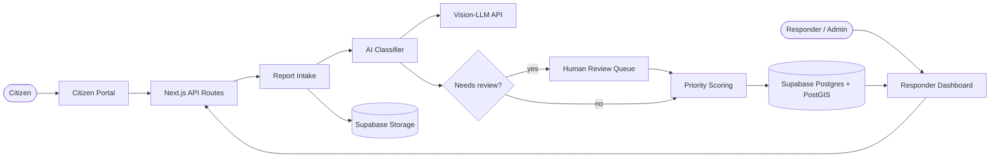

<div align="center">

# 🚨 SAGIP-AI

**Smart AI for Geospatial Intelligence and Prediction**

An AI-assisted emergency reporting and incident prioritization platform. Citizens report emergencies in under a minute. Responders see a ranked, map-based view of what needs help first.


[📖 Documentation](docs/DOCUMENTATION.md) · [🏗️ Architecture](docs/DOCUMENTATION.md#7-system-architecture) · [🗃️ Data Model](docs/DOCUMENTATION.md#9-data-model) · [🔌 API](docs/DOCUMENTATION.md#10-api-endpoints)

</div>

---

## About

Emergency reports (fires, floods, accidents, structural damage, medical emergencies) often arrive through scattered channels such as phone calls, social media, and word of mouth. Responders have no single, prioritized view of what is happening and where.

**SAGIP-AI** gives citizens one simple way to report an incident with a photo, a short description, and their location. A vision AI classifies each report. A transparent, deterministic formula ranks it. Responders act on the most urgent incidents first. The AI **assists and does not decide**: low-confidence and high-severity cases always go to a human for review.

```
Citizen reports incident  →  AI classifies type + severity  →  Human review if flagged
→  Priority score (explainable)  →  Ranked on responder dashboard + map
→  Team assigned  →  Status updates  →  Citizen tracks progress
```

## Key Features

| Feature | Description |
|---------|-------------|
| 📸 **Citizen Reporting** | Photo, short description, and auto-captured GPS location. No account needed. |
| 🤖 **AI Classification** | Vision-LLM returns incident type, severity, confidence, and visible hazards. |
| 🧑‍⚖️ **Human-in-the-Loop Review** | Low-confidence and high/critical cases are flagged for responder confirmation. |
| 📊 **Priority Scoring** | Deterministic score from severity, affected population, location risk, and incident type, with a visible breakdown. |
| 🗺️ **Live Map & Ranked List** | Responder dashboard with severity-colored markers and a priority-sorted list. |
| 👥 **Assignment & Status** | Assign incidents to teams and track them from received to resolved. |
| 🔎 **Report Tracking** | Citizens check progress using a tracking code. |
| 🧾 **Audit Trail** | Every AI output, override, and status change is logged. |
| 📈 **Analytics** *(v1.5)* | Incident volume by type, time, and location, plus response times. |

## Architecture



See the [full architecture and sequence diagrams](docs/DOCUMENTATION.md#7-system-architecture).

## Tech Stack

| Layer | Technology |
|-------|------------|
| Frontend + API | Next.js (App Router), TypeScript, Tailwind CSS |
| Database | Supabase PostgreSQL + PostGIS, via Prisma |
| Storage and Auth | Supabase Storage (photos), Supabase Auth (role-based) |
| AI Classification | Swappable vision-LLM API (Gemini 2.5 Flash, Claude Haiku 4.5, or GPT-4o mini, under benchmarking) |
| Maps | Leaflet + OpenStreetMap |
| Hosting | Vercel and Supabase |

## Project Status

The project is in the **blueprint stage (Draft v1.1)**. The requirements, architecture, data model, API, and AI benchmarking plan are documented. Implementation will happen on the `development` branch.

**MVP scope:** citizen submission · AI classification · priority scoring · responder dashboard (ranked list + map + status) · human review flag.

## Documentation

The complete project documentation is in **[docs/DOCUMENTATION.md](docs/DOCUMENTATION.md)**. It covers:

- Feature and project information
- Problem, goals, stakeholders, scope, and feasibility
- User flow and UI breakdown
- Core concepts (severity tiers, review triggers, priority score and bands)
- System architecture (Mermaid diagrams)
- Design system, data model, and API endpoints
- Data sources, seeding, and frontend/backend architecture
- Setup, configuration, and common tasks
- Known issues, risks, and a quick reference for the next developer
- Future enhancements and the AI benchmarking plan

## Getting Started

> The app has not been scaffolded yet. These steps apply once code lands on `development`.

```bash
git clone https://github.com/helidastar/SAGIP-AI.git
cd SAGIP-AI
git checkout development
npm install
cp .env.example .env.local   # add Supabase + AI provider keys
npx prisma migrate dev
npm run db:seed
npm run dev
```

## Branching Strategy

| Branch | Purpose |
|--------|---------|
| `main` | Stable, reviewed work and project documentation |
| `development` | Integration branch for ongoing implementation |

Changes flow from feature branches into `development`, then into `main` through pull requests.

## Contributors

| Name | GitHub |
|------|--------|
| Charity Ricabo | [@helidastar](https://github.com/helidastar) |
| Maria Mhikyla Jayno | [@mhiksNmatch](https://github.com/mhiksNmatch) |
| Reign Marie Hamo-ay | [@reignnn-h](https://github.com/reignnn-h) |
| John Vincent Fabroa | [@Beynsz](https://github.com/Beynsz) |

<div align="center">

**CCRVIBE 2.0** · Instructor: Rex A. Seadiño Jr.

</div>
