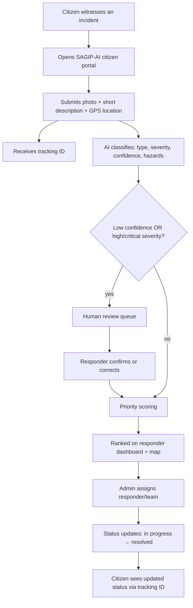
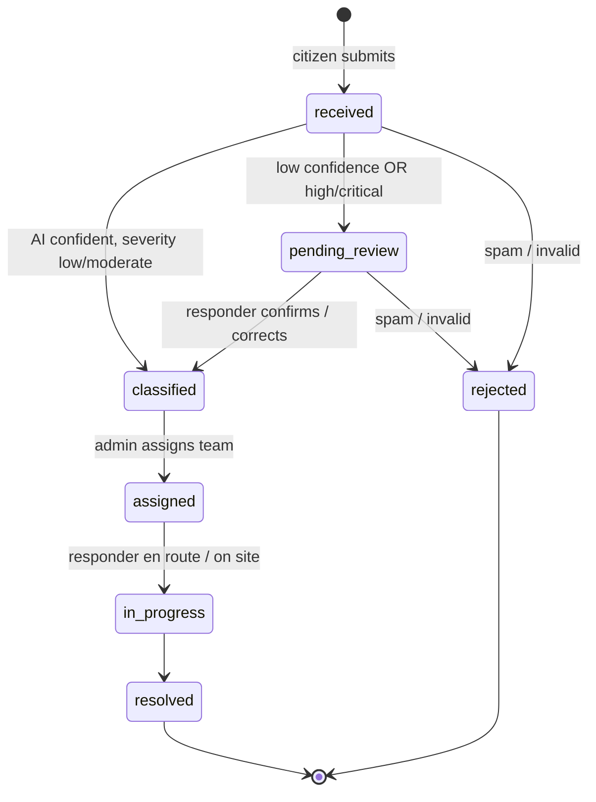
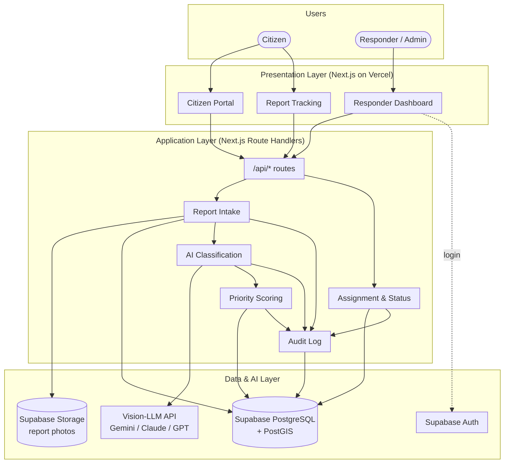
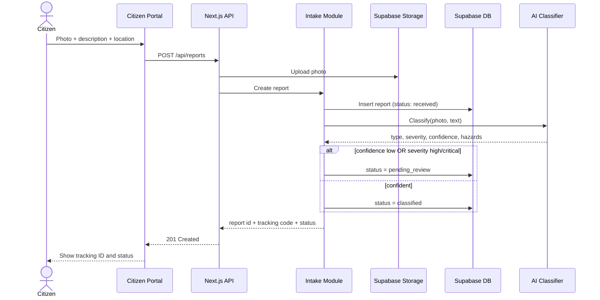
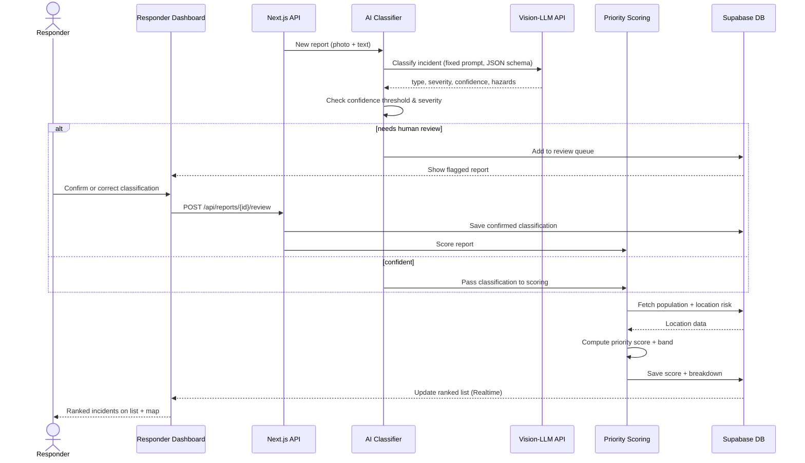
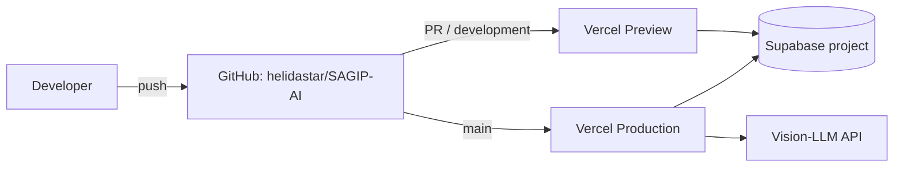
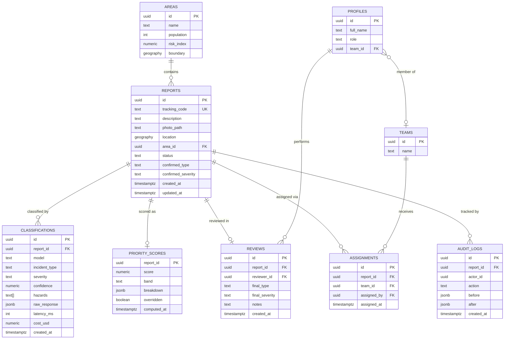

# SAGIP-AI — Project Documentation

> **Status:** Draft v1.1 — blueprint / planning stage. No app code has been written yet. Anything marked *(planned)* describes the intended MVP design, taken from the *SAGIP-AI Project Documentation* (CCRVIBE 2.0, September 03, 2026).
> Diagrams are written in [Mermaid](https://mermaid.js.org/) and render directly on GitHub.

## Table of Contents
1. [Feature Information](#1-feature-information)
2. [Project Information](#2-project-information)
3. [Overview](#3-overview)
4. [User Flow](#4-user-flow)
5. [User Interface & Features Breakdown](#5-user-interface--features-breakdown)
6. [Core Concepts](#6-core-concepts)
7. [System Architecture](#7-system-architecture)
8. [Design System](#8-design-system)
9. [Data Model](#9-data-model)
10. [API Endpoints](#10-api-endpoints)
11. [Data Sources & Seeding](#11-data-sources--seeding)
12. [Frontend Architecture](#12-frontend-architecture)
13. [Backend Implementation](#13-backend-implementation)
14. [Setup & Configuration](#14-setup--configuration)
15. [Common Tasks](#15-common-tasks)
16. [Known Issues, Caveats & Open Questions](#16-known-issues-caveats--open-questions)
17. [Quick Reference for the Next Developer](#17-quick-reference-for-the-next-developer)
18. [Appendix A — Future Enhancements](#appendix-a--future-enhancements)
19. [Appendix B — AI Classification Benchmarking Plan](#appendix-b--ai-classification-benchmarking-plan)
20. [Appendix C — Documentation Checklist](#appendix-c--documentation-checklist)

---

## 1. Feature Information

| Field | Value |
|-------|-------|
| **Feature / Product** | SAGIP-AI — Smart AI for Geospatial Intelligence and Prediction |
| **Type** | Mobile-first citizen web portal + desktop responder/admin dashboard |
| **Status** | Draft v1.1 (blueprint — architecture and requirements defined) |
| **Course / Event** | CCRVIBE 2.0 |
| **Instructor** | Rex A. Seadiño Jr. |
| **Primary users** | Citizens reporting emergencies (fire, flood, accident, structural damage, medical, etc.) |
| **Secondary users** | Responders / field teams, admins / dispatch, LGU / DRRMO |
| **Frontend + API** | Next.js (App Router), TypeScript |
| **Database** | Supabase (PostgreSQL + PostGIS), accessed via Prisma |
| **Storage / Auth** | Supabase Storage (report photos), Supabase Auth (role-based, responders/admins only) |
| **AI** | External vision-LLM API (swappable — Gemini 2.5 Flash / Claude Haiku 4.5 / GPT-4o mini under evaluation) |
| **Maps** | Leaflet + OpenStreetMap tiles (or Google Maps API) |
| **Hosting** | Vercel (app) + Supabase (DB, storage, auth) |
| **Architecture style** | Modular monolith |
| **Key flow** | Citizen reports → AI classifies → human review if flagged → priority score → ranked on responder dashboard |

---

## 2. Project Information

### Repository
| Field | Value |
|-------|-------|
| **Repository** | [github.com/helidastar/SAGIP-AI](https://github.com/helidastar/SAGIP-AI) |
| **Default branch** | `main` |
| **Documentation** | `docs/DOCUMENTATION.md` (this file) on `main` |

### Branches
| Branch | Purpose | Status |
|--------|---------|--------|
| `main` | Stable, reviewed work and project documentation. Production deploys come from here. | Exists |
| `development` | Integration branch for ongoing implementation work. | Exists |
| `frontend` *(suggested)* | Citizen portal + responder dashboard UI | Suggested |
| `backend` *(suggested)* | Supabase schema, API routes, AI classifier, priority scoring | Suggested |

**Branch flow:** `feature branches → development → main` (via pull requests).

### Contributors
| Name | GitHub |
|------|--------|
| Charity Ricabo | [@helidastar](https://github.com/helidastar) |
| Maria Mhikyla Jayno | [@mhiksNmatch](https://github.com/mhiksNmatch) |
| Reign Marie Hamo-ay | [@Reignnnh04](https://github.com/Reignnnh04) |
| John Vincent Fabroa | [@Beynsz](https://github.com/Beynsz) |

### Commit history (to date)
| Date | Author | Commit |
|------|--------|--------|
| 2026-08-27 | Charity Ricabo | Initial commit |
| 2026-09-11 | Charity Ricabo | RENAME |

---

## 3. Overview

### 3.1 Problem statement
Emergency and incident reports from citizens (fires, floods, accidents, structural damage, medical emergencies, etc.) arrive through scattered, informal channels — phone calls, social media, word of mouth. Responders have **no unified, prioritized view** of what is happening where, which incidents are most urgent, and how severe each one actually is. This slows response and makes it hard to allocate limited responder resources to the incidents that need them most.

### 3.2 Goals
- Give citizens **one simple channel** to report an emergency with photo, description, and location.
- **Automatically classify** and estimate the severity of each report using AI, so incidents don't sit unreviewed.
- **Rank incidents** by a transparent priority score (severity, affected population, location, incident type) so responders act on what matters most first.
- Give responders/admins a **live dashboard**: map view, ranked incident list, assignment, and status tracking.
- Keep the AI **assistive, not authoritative** — flag high-severity or low-confidence cases for human review instead of auto-dispatching on AI output alone.

### 3.3 Success looks like
- A citizen can submit a report in **under a minute**, from a phone, with minimal typing.
- A responder can see a ranked, map-based view of open incidents and **understand why** something is ranked where it is.
- The AI classification is accurate enough that responders **trust the ranking** instead of falling back to manual triage.

### 3.4 Stakeholders
| Stakeholder | Interest / role | What they need from the system |
|-------------|-----------------|--------------------------------|
| Citizens (reporters) | Submit and track incident reports | Fast, simple reporting; confirmation their report was seen |
| Responders / field teams | Act on incidents | Accurate priority ranking, clear location, current status |
| Admins / dispatch | Oversee and assign incidents | Dashboard, analytics, ability to override AI ranking |
| LGU / DRRMO or campus safety office | Institutional owner / pilot partner | Reliability, auditability, no legal exposure from bad AI calls |
| Development team | Build and maintain the system | Clear scope, feasible timeline, defensible AI design decisions |
| Academic panel / adviser | Evaluate the project | Demonstrated technical soundness of the AI component |

### 3.5 Scope & prioritization
| Priority | Items |
|----------|-------|
| **Must-have (v1 / MVP)** | Citizen report submission (photo, text, location) · AI classification (type + severity + confidence) · Deterministic, explainable priority score · Responder dashboard (ranked list + basic map + status update) · Human review flag for high-severity / low-confidence cases |
| **Should-have (v1.5)** | Citizen-facing status tracking · Assignment workflow (incident → responder/team) · Basic analytics (volume by type / time / location) |
| **Nice-to-have (later)** | Duplicate report clustering · Offline-first submission queue · Safety guidance per incident type · Two-tier AI escalation for ambiguous cases |

> **Recommended first build target:** the AI classification + priority scoring pipeline is the actual innovation. Build just enough of the portal and dashboard to prove the pipeline works end to end on real submissions.

### 3.6 Feasibility summary
| Area | Rating | Notes |
|------|--------|-------|
| Technical | **High** | All components are off-the-shelf (vision-LLM API, weighted formula, map dashboard, web form). Risk is integration and scope, not research. |
| Operational | **Medium** | Needs a real pilot partner, responder trust in the ranking, and a staffing plan for reviewing flagged cases. |
| Financial | **Low cost** | Classification costs a fraction of a cent per image; development time is the main cost. |
| Legal / liability | **Needs care** | An AI misranking a serious incident is a liability issue — mitigated by design via human-in-the-loop review. |

---

## 4. User Flow

### 4.1 Core loop



### 4.2 Report status lifecycle



Citizen-facing labels collapse these into: **Received → Under review → Responder assigned → Resolved**.

---

## 5. User Interface & Features Breakdown

Two distinct interfaces, one shared design system (see [Section 8](#8-design-system)).

### 5.1 Citizen portal *(planned — mobile-first, no account required)*
| Screen | Contents |
|--------|----------|
| **Report incident** | Camera / photo upload, short text description, GPS location auto-captured (editable pin on map), submit button |
| **Confirmation** | Reference / tracking ID, current status, "save this ID" hint |
| **Track report** | Enter tracking ID → status timeline (Received → Under review → Responder assigned → Resolved) |
| **Safety guidance** *(stretch)* | Basic do's and don'ts based on the incident type |

Design priorities: minimal steps, large touch targets, plain language, works on low-end phones and weak connections.

### 5.2 Responder / admin dashboard *(planned — desktop, authenticated)*
| View | Contents |
|------|----------|
| **Ranked incident list** | Open incidents sorted by priority score; severity color chip, type, location, age, status, "needs review" badge; manual override of rank |
| **Map view** | Live incident markers colored by severity (same scale as the list); click marker → incident detail |
| **Incident detail** | Photo, description, AI output (type, severity, confidence, hazards), **priority score breakdown** (why it ranked here), audit history, assign + status controls |
| **Review queue** | Flagged reports (low confidence / high severity) awaiting confirmation or correction |
| **Analytics** *(v1.5)* | Volume over time, by type, by location; response-time tracking |
| **Definitions / legend** | Explains severity tiers, priority bands, and scoring weights so responders can interpret rankings |

---

## 6. Core Concepts

### 6.1 Incident types
`fire`, `flood`, `landslide` (incl. soil erosion), `road_accident`, `structural_damage` (incl. collapse), `medical_emergency`, `fallen_debris` (trees / debris), `other`.

### 6.2 Severity tiers
| Tier | Value | Color token | Meaning (guideline) |
|------|-------|-------------|---------------------|
| **Low** | 1 | `--sev-low` (green) | Minor, no immediate danger to life |
| **Moderate** | 2 | `--sev-moderate` (yellow) | Property damage or potential danger; response needed soon |
| **High** | 3 | `--sev-high` (orange) | Active danger to people or major property; urgent |
| **Critical** | 4 | `--sev-critical` (red) | Life-threatening, mass-casualty potential; immediate |

The same scale is used everywhere: list chips, map markers, detail view.

### 6.3 Hierarchy
```
Incident (one real-world event)
 └── Report(s)            ← citizen submissions (1 in MVP; many once duplicate clustering exists)
      ├── Classification  ← AI output (versioned, one per model run)
      ├── Review          ← human confirmation / correction (if flagged)
      └── Priority score  ← deterministic, computed from final classification + location data
```

### 6.4 AI-estimated vs. confirmed severity
- **AI severity** — what the vision-LLM returned. Stored as-is, never overwritten.
- **Confirmed severity** — what a responder set during review (or equals AI severity if no review was needed).
- The **priority score always uses the confirmed value**. Keeping both lets us measure AI accuracy over time and supports auditability.

### 6.5 Human review triggers
A report goes to `pending_review` if **either**:
1. `confidence < CONFIDENCE_THRESHOLD` (initial value `0.70`, tuned after benchmarking), or
2. AI severity is `high` or `critical`.

### 6.6 Priority score *(proposed — to be finalized in its own design doc)*
Deterministic, plain logic (not an LLM call), so every score is explainable:

```
priority = 100 × ( w_sev  × severity_norm
                 + w_pop  × population_norm
                 + w_loc  × location_risk_norm
                 + w_type × type_weight )

initial weights: w_sev = 0.45, w_pop = 0.25, w_loc = 0.15, w_type = 0.15
```
Each input is normalized to 0–1. The dashboard shows each term's contribution.

### 6.7 Priority bands
| Band | Score | Label |
|------|-------|-------|
| **P1** | 80–100 | Immediate |
| **P2** | 60–79 | Urgent |
| **P3** | 40–59 | Standard |
| **P4** | 0–39 | Low |

---

## 7. System Architecture

### 7.1 Architecture style
A **modular monolith**: one Next.js app with clearly separated modules. Faster to build, easier to debug, and easier for a small team to maintain than microservices. Revisit only if a module (e.g. AI classification) needs to scale independently.

### 7.2 High-level architecture



### 7.3 Report intake sequence



### 7.4 Classification, review & ranking sequence



### 7.5 Deployment



### 7.6 Key design decisions
- **AI classification is swappable** — a provider-agnostic interface, not hard-wired to one vendor's SDK, so the model can change based on benchmarking.
- **Priority scoring is separate and deterministic** — plain, auditable code so anyone can see why an incident got its score.
- **Human review is a first-class status** in the data model, not an afterthought.
- **Citizens submit without an account** — speed during an emergency beats data completeness.
- **PostGIS from day one** — geo-queries ("incidents near X") are core to the map and ranking.

---

## 8. Design System

Both surfaces share one set of tokens (color, typography, components) even though their layouts differ.

### 8.1 Colors *(proposed)*
| Token | Use |
|-------|-----|
| `--sev-low` `#16A34A` | Low severity |
| `--sev-moderate` `#EAB308` | Moderate severity |
| `--sev-high` `#EA580C` | High severity |
| `--sev-critical` `#DC2626` | Critical severity |
| `--brand-primary` `#1E3A5F` | Headers, primary actions |
| `--review` `#7C3AED` | "Needs review" badge |
| `--surface` / `--text` | Neutral background and text |

Severity is never conveyed by color alone — always pair with a label or icon.

### 8.2 Typography & layout
- System / Inter font stack, large base size on citizen portal (≥ 16px) for readability under stress.
- Citizen portal: single-column, one primary action per screen.
- Dashboard: dense two-pane layout (ranked list + map), detail in a side panel.

### 8.3 Reusable components
`SeverityChip`, `PriorityBadge`, `StatusPill`, `ReviewBadge`, `IncidentCard`, `IncidentMarker`, `ScoreBreakdown`, `PhotoUploader`, `LocationPicker`, `StatusTimeline`, `DefinitionsModal`.

---

## 9. Data Model

### 9.1 Entity relationship diagram *(planned — Supabase PostgreSQL + PostGIS via Prisma)*



### 9.2 Tables
| Table | Purpose |
|-------|---------|
| `reports` | One citizen submission. `status` ∈ `received`, `pending_review`, `classified`, `assigned`, `in_progress`, `resolved`, `rejected`. |
| `classifications` | Every AI run (append-only), including raw model output, latency, and cost — for auditability and benchmarking. |
| `reviews` | Human confirmation/correction of a flagged report. |
| `priority_scores` | Current score, band, per-term breakdown, and whether an admin overrode it. |
| `assignments` | Report → team assignments (history kept). |
| `teams` / `profiles` | Responder teams and staff accounts (`profiles.id` = `auth.users.id`; `role` ∈ `responder`, `admin`). |
| `areas` | Barangay / zone polygons with population and risk index, used by scoring. |
| `audit_logs` | Every status change, override, and review — who, what, before/after. |

### 9.3 Security (Supabase RLS)
- **Anonymous** citizens: `INSERT` on `reports` only (via API route), and read a single report's public status by `tracking_code`.
- **Responders / admins**: read all reports; responders update status on assigned reports; admins can assign, override scores, and manage teams.
- Photos are in a **private bucket**; the dashboard uses short-lived signed URLs.

---

## 10. API Endpoints

*(planned — Next.js Route Handlers under `src/app/api`)*

### 10.1 Citizen (public)
| Method | Route | Description |
|--------|-------|-------------|
| `POST` | `/api/reports` | Submit a report (multipart: photo, description, lat, lng) |
| `GET` | `/api/reports/track/{trackingCode}` | Public status of a report |

### 10.2 Responder / admin (authenticated)
| Method | Route | Description |
|--------|-------|-------------|
| `GET` | `/api/incidents?status=&band=&type=` | Ranked incident list |
| `GET` | `/api/incidents/{id}` | Detail incl. classifications, score breakdown, audit log |
| `GET` | `/api/incidents/map?bbox=` | GeoJSON of open incidents within a bounding box |
| `GET` | `/api/review-queue` | Reports in `pending_review` |
| `POST` | `/api/reports/{id}/review` | Confirm / correct classification |
| `PATCH` | `/api/incidents/{id}/status` | Update status |
| `POST` | `/api/incidents/{id}/assign` | Assign to a team *(admin)* |
| `PATCH` | `/api/incidents/{id}/priority` | Manually override score / band *(admin)* |
| `POST` | `/api/incidents/{id}/reclassify` | Re-run AI classification *(admin)* |
| `GET` | `/api/analytics/summary?from=&to=` | Volume by type / time / area, response times *(v1.5)* |

### 10.3 Example responses

`POST /api/reports` → `201 Created`
```json
{
  "id": "6f1c2e0a-5b7d-4a1e-9d3f-2c8b1a7e4f90",
  "trackingCode": "SGP-7K3Q9D",
  "status": "pending_review",
  "message": "Report received. Save your tracking code to check its status."
}
```

`GET /api/reports/track/SGP-7K3Q9D` → `200 OK`
```json
{
  "trackingCode": "SGP-7K3Q9D",
  "status": "assigned",
  "publicStatus": "Responder assigned",
  "incidentType": "flood",
  "updatedAt": "2026-09-11T08:42:10Z"
}
```

`GET /api/incidents/{id}` → `200 OK`
```json
{
  "id": "6f1c2e0a-5b7d-4a1e-9d3f-2c8b1a7e4f90",
  "status": "classified",
  "location": { "lat": 10.3157, "lng": 123.8854, "area": "Barangay Lahug" },
  "classification": {
    "model": "gemini-2.5-flash",
    "incidentType": "flood",
    "severity": "high",
    "confidence": 0.82,
    "hazards": ["rising water", "stranded vehicles"]
  },
  "review": { "finalSeverity": "high", "reviewer": "J. Dela Cruz" },
  "priority": {
    "score": 78.4,
    "band": "P2",
    "breakdown": { "severity": 33.8, "population": 21.5, "locationRisk": 11.1, "type": 12.0 },
    "overridden": false
  }
}
```

---

## 11. Data Sources & Seeding

### 11.1 Sources *(planned)*
| Data | Source |
|------|--------|
| Incident types, severity tiers, weights | `src/lib/constants.ts` |
| Areas (barangay boundaries, population) | PSA census population data + barangay boundary GeoJSON (from pilot LGU / open data) |
| Location risk index | LGU / DRRMO hazard maps (flood, landslide), set per area |
| Demo teams & staff | Seed script (test accounts only) |
| Benchmark images | 40–60 labeled Philippine incident photos (see [Appendix B](#appendix-b--ai-classification-benchmarking-plan)) |

### 11.2 Seed script
`npm run db:seed` → `prisma/seed.ts` loads constants, areas from `prisma/seed-data/areas.geojson`, demo teams/profiles, and optional sample reports for dashboard demos.

### 11.3 Idempotent process
- Use `upsert` keyed on natural keys (area `name`, team `name`, report `tracking_code`) so re-running the seed never duplicates rows.
- Sample reports are tagged `is_demo = true` and can be cleared with `npm run db:seed -- --reset-demo`.

---

## 12. Frontend Architecture

### 12.1 Folder structure *(planned — Next.js App Router)*
```
src/
├── app/
│   ├── (citizen)/
│   │   ├── page.tsx               # Report incident
│   │   ├── submitted/page.tsx     # Confirmation + tracking ID
│   │   └── track/page.tsx         # Track report status
│   ├── (dashboard)/dashboard/
│   │   ├── page.tsx               # Ranked list + map
│   │   ├── incidents/[id]/page.tsx
│   │   ├── review/page.tsx        # Review queue
│   │   └── analytics/page.tsx
│   ├── login/page.tsx
│   └── api/                       # Route handlers (Section 10)
├── components/
│   ├── citizen/                   # PhotoUploader, LocationPicker, StatusTimeline
│   ├── dashboard/                 # IncidentList, IncidentMap, ScoreBreakdown
│   └── ui/                        # SeverityChip, PriorityBadge, StatusPill, DefinitionsModal
├── lib/
│   ├── ai/                        # classifier interface + providers
│   ├── scoring/                   # priority formula + banding
│   ├── supabase/                  # client/server helpers
│   ├── prisma.ts
│   └── constants.ts
└── types/
```

### 12.2 Styling
- Tailwind CSS with design tokens from [Section 8](#8-design-system) exposed as CSS variables.
- Map: `react-leaflet` with OpenStreetMap tiles; markers use the severity scale.
- Citizen pages must stay lightweight (compress photos client-side to ~1000×1000 px before upload — also cuts AI token cost).

---

## 13. Backend Implementation

### 13.1 AI classifier module (`src/lib/ai/`)
```ts
export interface IncidentClassification {
  incidentType: IncidentType;
  severity: Severity;
  confidence: number;      // 0–1
  hazards: string[];
}

export interface Classifier {
  model: string;
  classify(input: { image?: { data: Buffer; mimeType: string }; description: string },
           options?: { signal?: AbortSignal }): Promise<ClassifierResult>;
}
```
Every provider implements the same interface; `AI_PROVIDER` picks the primary and `AI_FALLBACK_PROVIDER` the fallback.

| Provider | File | Cost | Status |
|---|---|---|---|
| `gemini` | `gemini.ts` | Free tier (daily reset) | **In use** (primary + fallback) |
| `local` | `local.ts` | Free, runs on our server (ONNX) | Code ready, model not trained yet |
| `claude` | `claude.ts` | Paid only | Not configured |
| `llama` | `llama.ts` | Needs credits on current hosts | Not configured (see AI log 2026-09-21) |
| keyword matcher | `keyword.ts` | Free | Always the last step |

API providers share one prompt and JSON schema (`prompt.ts`), and output is validated by `normalizeClassification()`. The `local` provider is our own image model (trained with `training/sagip_classifier_colab.ipynb`). It predicts only the incident type from the photo; severity and hazards come from the description keywords.

**Chain (`chain.ts`):** primary → retry once on 429/5xx/timeout → fallback → keyword matcher. When the primary is `local`, answers below `CONFIDENCE_THRESHOLD` are **escalated** to the fallback for a second opinion. If that fails, the local answer is kept and goes to human review.

### 13.2 Constants *(planned `src/lib/constants.ts`)*
```ts
export const INCIDENT_TYPES = [
  "fire", "flood", "landslide", "road_accident",
  "structural_damage", "medical_emergency", "fallen_debris", "other",
] as const;

export const SEVERITY = { low: 1, moderate: 2, high: 3, critical: 4 } as const;

export const CONFIDENCE_THRESHOLD = 0.7;
export const REVIEW_SEVERITIES = ["high", "critical"];

export const PRIORITY_WEIGHTS = { severity: 0.45, population: 0.25, locationRisk: 0.15, type: 0.15 };

export const TYPE_WEIGHTS: Record<IncidentType, number> = {
  fire: 1.0, medical_emergency: 1.0, structural_damage: 0.9, flood: 0.85,
  landslide: 0.85, road_accident: 0.8, fallen_debris: 0.5, other: 0.4,
};
```

### 13.3 Priority banding *(planned `src/lib/scoring/`)*
```ts
export const PRIORITY_BANDS = [
  { band: "P1", min: 80, label: "Immediate" },
  { band: "P2", min: 60, label: "Urgent" },
  { band: "P3", min: 40, label: "Standard" },
  { band: "P4", min: 0,  label: "Low" },
] as const;

export function toBand(score: number) {
  return PRIORITY_BANDS.find((b) => score >= b.min)!;
}
```
`computePriority()` returns both the score and the per-term breakdown, which is stored in `priority_scores.breakdown`.

---

## 14. Setup & Configuration

> Applies once the app is scaffolded on `development`.

### 14.1 Prerequisites
- Node.js 20+ and npm
- Git
- A Supabase project (PostGIS extension enabled)
- An API key for the chosen vision-LLM provider
- *(optional)* Supabase CLI for local development

### 14.2 Environment variables (`.env.local`)
```bash
NEXT_PUBLIC_SUPABASE_URL=https://<project>.supabase.co
NEXT_PUBLIC_SUPABASE_ANON_KEY=<anon-key>
SUPABASE_SERVICE_ROLE_KEY=<service-role-key>   # server only, never expose
DATABASE_URL=postgresql://...                  # pooled connection for Prisma
DIRECT_URL=postgresql://...                    # direct connection for migrations
AI_PROVIDER=gemini                             # gemini | local | claude | llama | mock
AI_API_KEY=<provider-key>                      # not needed for local
AI_MODEL=gemini-3.1-flash-lite                 # for local: path to the .onnx file
AI_FALLBACK_PROVIDER=gemini
AI_FALLBACK_API_KEY=<provider-key>
AI_FALLBACK_MODEL=gemini-3.5-flash
CONFIDENCE_THRESHOLD=0.7
```
See `.env.example` for the full list (timeouts, base URLs, daily budget, rate limit).
Never commit `.env.local`.

### 14.3 Database init
```bash
git clone https://github.com/helidastar/SAGIP-AI.git
cd SAGIP-AI
git checkout development
npm install
npx prisma migrate dev
npm run db:seed
```
In Supabase: enable `postgis`, create a private `report-photos` bucket, and apply the RLS policies in `supabase/policies.sql`.

### 14.4 Running
```bash
npm run dev      # http://localhost:3000
npm run build
npm run start
npm run lint
```

---

## 15. Common Tasks

### 15.1 Add a new incident type
1. Add it to `INCIDENT_TYPES` and `TYPE_WEIGHTS` in `src/lib/constants.ts`.
2. Update the classifier prompt and JSON schema in `src/lib/ai/`.
3. Add an icon/label in `DefinitionsModal` and the map legend.
4. Add benchmark images for it and re-run the benchmark.

### 15.2 Update a definition (severity, band, legend text)
Edit `src/lib/constants.ts` / `src/lib/scoring/`, then update the `DefinitionsModal` copy and [Section 6](#6-core-concepts) of this document together.

### 15.3 Adjust the confidence threshold or priority weights
Change `CONFIDENCE_THRESHOLD` or `PRIORITY_WEIGHTS`. Document the reason (e.g. benchmark results) in the PR. Existing scores are not recalculated automatically — run `npm run scores:recompute` if needed.

### 15.4 Link a responder to a team / make someone an admin
Create the user in Supabase Auth, then set `profiles.role` (`responder` or `admin`) and `profiles.team_id`.

### 15.5 Switch AI provider
Set `AI_PROVIDER` and `AI_API_KEY`. The `classifications.model` column records which model and chain step produced each result (e.g. `primary:gemini-3.1-flash-lite`, `escalation:gemini-3.5-flash`, `keyword-fallback`).

To use our own model: train it with `training/sagip_classifier_colab.ipynb`, put `sagip-classifier.onnx` and `labels.json` in `models/`, then set `AI_PROVIDER=local` (no key). Keep Gemini as the fallback so unsure answers get a second opinion.

### 15.6 Add a new area
Add the polygon, population, and risk index to `prisma/seed-data/areas.geojson` and re-run `npm run db:seed` (idempotent).

---

## 16. Known Issues, Caveats & Open Questions

### 16.1 Open questions
- **No named pilot partner yet** (barangay, city DRRMO, or campus safety office). Without one, there are no real incidents to rank. Resolve early.
- **Who staffs the review queue in real time?** This is a process and staffing question, not only a software one.
- **Final priority formula** — the weights in [6.6](#66-priority-score-proposed--to-be-finalized-in-its-own-design-doc) are placeholders until a model is chosen and benchmarked.

### 16.2 Risk register
| Risk | Likelihood | Impact | Mitigation |
|------|------------|--------|------------|
| AI misclassifies a high-severity incident as low priority | Medium | High | Mandatory human review for low-confidence and high-severity cases; never fully automate dispatch |
| No institutional pilot partner / no real users | Medium | High | Secure a partner before heavy build investment |
| Responders don't trust the AI ranking | Medium | Medium | Transparent formula, visible score breakdown, manual override, involve responders in design |
| Spam or false reports flood the dashboard | Medium | Medium | Validation, rate limiting, later duplicate clustering |
| System overload during a disaster spike | Low–Medium | High | Load-test submission + classification; degrade gracefully |
| Citizen photos / location exposed | Low | High | RLS, private bucket, signed URLs, privacy practices |
| Scope creep across 4 bundled sub-products | High | Medium | Hold to MVP scope in [3.5](#35-scope--prioritization) |
| AI vendor pricing / availability changes | Low | Low | Swappable classifier module |
| Database not built for geo-queries | Low | Medium | PostGIS enabled from the start |
| Single managed provider (Supabase) | Low | Medium | Standard Postgres underneath — migration possible |

### 16.3 Technical caveats
- AI classification is **assistive** — the UI must always show that a score came from AI and whether it was human-confirmed.
- Serverless functions have time limits; keep classification under a few seconds or move it to a background job/queue if latency grows.
- Phone photos are large — resize client-side before upload.
- Citizens have no account, so tracking relies on the tracking code; treat it as a bearer secret (no personal data on the public status page).

---

## 17. Quick Reference for the Next Developer

| Need to… | Go to |
|----------|-------|
| Understand the product | [Section 3](#3-overview) |
| See how data flows | [Section 7](#7-system-architecture) |
| Change severity / weights / thresholds | `src/lib/constants.ts` |
| Change the scoring formula | `src/lib/scoring/` |
| Change / add an AI provider | `src/lib/ai/` |
| Change the DB schema | `prisma/schema.prisma` → `npx prisma migrate dev` |
| Seed data | `npm run db:seed` |
| API contract | [Section 10](#10-api-endpoints) |

**Rules of thumb**
1. Never let AI output skip human review for high/critical cases.
2. Keep scoring deterministic — no LLM calls inside `scoring/`.
3. Log every override and status change to `audit_logs`.
4. Same severity colors everywhere.
5. Keep the citizen flow under a minute on a low-end phone.
6. Work on a feature branch → PR into `development` → PR into `main`.

---

## Appendix A — Future Enhancements
- Duplicate / near-duplicate report clustering (image + location + time similarity).
- Offline-first submission queue with retry on poor connectivity.
- Safety guidance content for citizens based on incident type.
- Two-tier AI: escalate ambiguous cases to a stronger model (e.g. Claude Sonnet 4.6).
- SMS / hotline intake for citizens without data.
- Push / SMS notifications to citizens on status change.
- Responder mobile view with navigation to the incident.
- Integration with LGU / DRRMO systems.

---

## Appendix B — AI Classification Benchmarking Plan

A research and evaluation plan, not the final model choice.

### B.1 Candidate models
| Model | Why shortlisted | Input $/1M | Output $/1M | Est. cost / scan |
|-------|-----------------|-----------|-------------|------------------|
| Gemini 2.5 Flash | Cheapest frontier-class option, fast | ~$0.15–0.30 | ~$0.60–2.50 | ~$0.0008 |
| GPT-4o mini | Budget baseline | ~$0.15 | ~$0.60 | ~$0.0003 |
| Claude Haiku 4.5 | Strong structured JSON output | ~$1 | ~$5 | ~$0.0022 |
| Claude Sonnet 4.6 | Escalation tier for low-confidence cases | ~$3 | ~$15 | ~$0.0064 |

*Estimates as of drafting — reconfirm current pricing before testing.* Cost per scan assumes a ~1000×1000 px photo (~1,350 input tokens incl. prompt) and ~150 output tokens.

At these costs, a few thousand classifications a month is only a few dollars, so **accuracy and reliability should drive the choice, not cost**.

**Update (2026-09-21) — free only.** The team has no budget, so the candidates are now limited to options that cost nothing:

| Candidate | Cost | Notes |
|---|---|---|
| Gemini `gemini-3.1-flash-lite` | Free tier, daily reset | Current primary. Higher free RPM than Flash |
| Gemini `gemini-3.5-flash` | Free tier, daily reset | Current fallback |
| **Own model** (EfficientNet-B0 / MobileNetV3, fine-tuned) | Free (Colab training, runs on our server) | Photo → incident type only. Was out of scope; now in scope as the no-quota option |
| Llama 4 Scout / Maverick | Needs credits on every current host | Dropped. Groq no longer serves Llama vision models |
| Claude, GPT | Paid only | Dropped |

Paid rows in the table above stay for reference only.

### B.2 Image size vs. token cost (Claude reference: ≈ width × height / 750)
| Image size | Megapixels | Tokens (approx.) | Note |
|------------|-----------|------------------|------|
| 500×500 | 0.25 | ~333 | Borderline usable |
| 1000×1000 | 1 | ~1,334 | **Target size** after client-side resize |
| 1568×1568 | 2.46 | ~3,277 | Upper bound before auto-downscale |
| 4000×3000 (phone) | 12 | Downscaled first | Capped at the model's max |

### B.3 Test dataset
- 40–60 images, 8–10 per category: fire, flood, landslide/soil erosion, road accident, structural damage/collapse, medical emergency, fallen trees/debris, and an "ambiguous/hard" bucket.
- Mixed quality: daylight, low light, motion blur, partial obstruction.
- Each manually labeled with ground-truth type and severity.

### B.4 Evaluation criteria
| Criterion | Weight |
|-----------|--------|
| Classification accuracy | 35% |
| Severity accuracy (within one tier) | 25% |
| Confidence reliability | 15% |
| Cost per classification | 15% |
| Latency | 10% |

### B.5 Procedure
1. Finalize images and labels.
2. Write one fixed prompt template for all models.
3. Run every image through every model.
4. Log output, correctness, confidence, latency, cost.
5. Score against B.4.
6. Note failure patterns (e.g. flood vs. burst-pipe water damage).
7. Recommend primary model, escalation model, and the review threshold.

> The small test set is directional, not statistically rigorous — expand it with real submission data later.

### B.6 Own model: training and comparison
1. Collect 100–300 labeled photos per incident type (folders named after `INCIDENT_TYPES`) from the free datasets listed in `training/README.md`, then run `npm run dataset:prepare` to clean them and hold out the benchmark photos.
2. Train on free Colab with `training/sagip_classifier_colab.ipynb`: 70/15/15 split with a locked test set, two-step fine-tuning, and ONNX export.
3. Record test-set accuracy, per-class results, confusion matrix and Brier score (the notebook saves `metrics.json`).
4. Compare with Gemini on the **same photos**: `npm run benchmark -- --models local,gemini:gemini-3.1-flash-lite`. Keep benchmark photos out of the training split, or the comparison is unfair.
5. If the local model is close to Gemini on type accuracy with **0 missed urgent**, make it the primary (`AI_PROVIDER=local`) with Gemini as escalation. Otherwise keep Gemini primary.

Save free-tier quota: develop with `AI_PROVIDER=mock`, validate with `--dry-run`, and run paid-provider benchmarks with small `--limit` and `--concurrency 1`.

---

## Appendix C — Documentation Checklist

| Item | Status |
|------|--------|
| Feature Information | Done |
| Project Information (repository, branches, contributors) | Done |
| Overview & core concepts | Done |
| UI / features breakdown | Done |
| System architecture (Mermaid diagrams) | Done |
| Data model & APIs | Done |
| Data sources & seeding | Done |
| Frontend & backend architecture | Done |
| Setup & configuration | Done |
| Common tasks | Done |
| Known issues, caveats & open questions | Done |
| Quick reference & appendices | Done |
| Final priority-scoring design doc (after model selection) | Pending |
| Benchmark results | Pending |
| Pilot partner confirmed | Pending |
