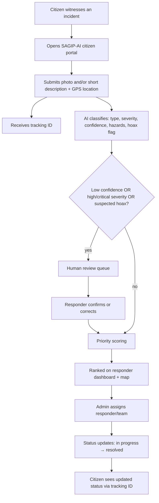
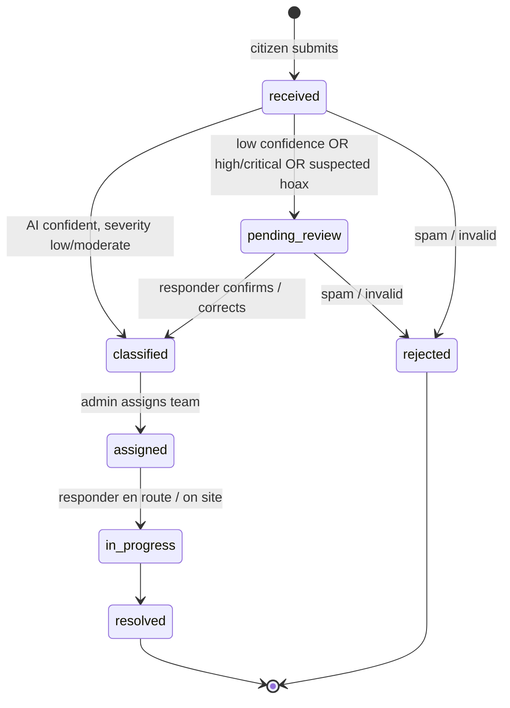
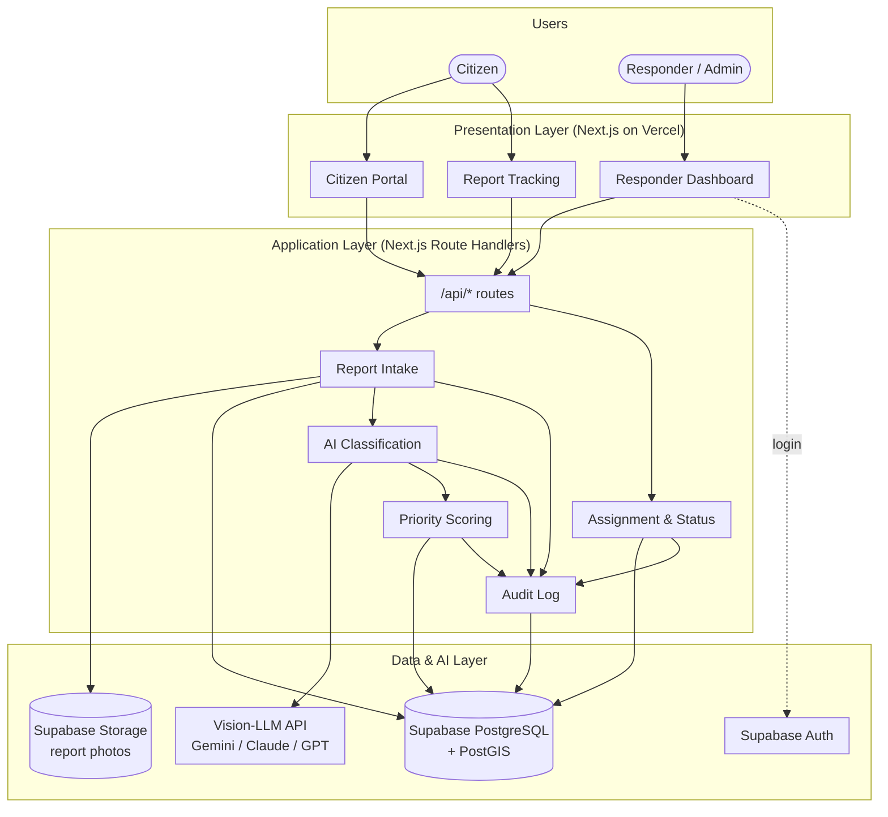
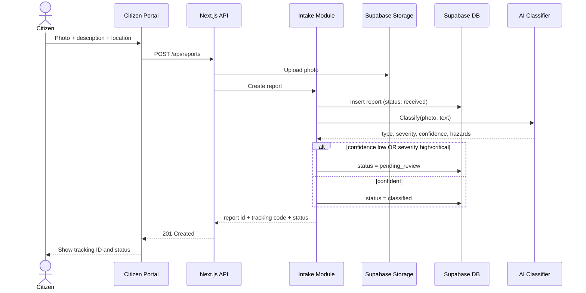
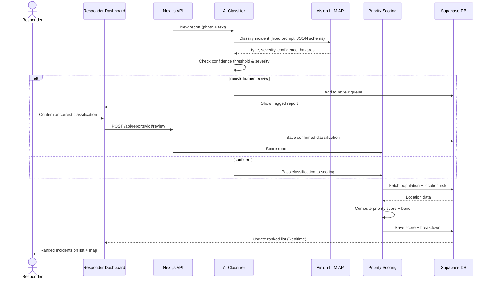
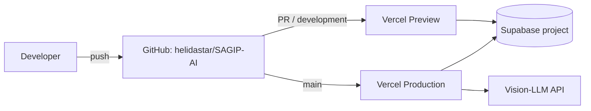
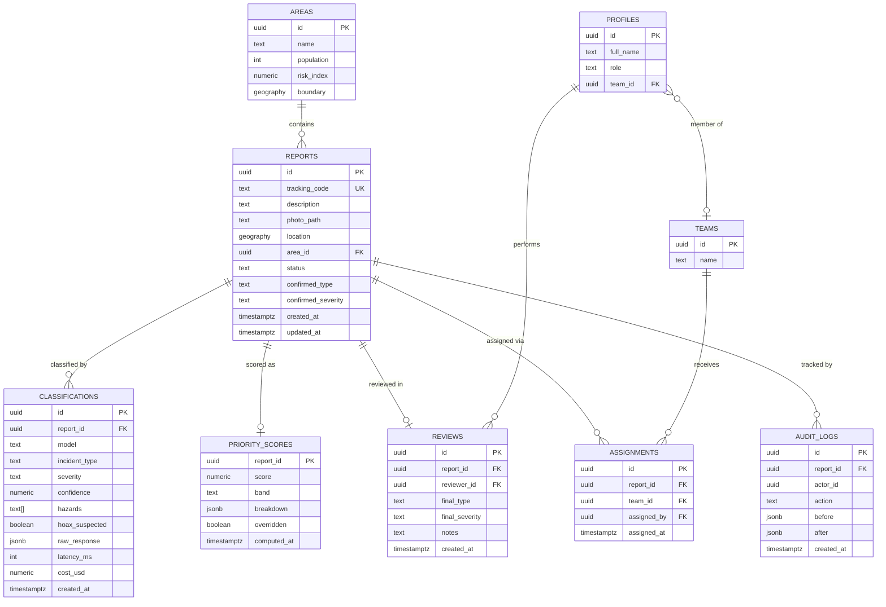
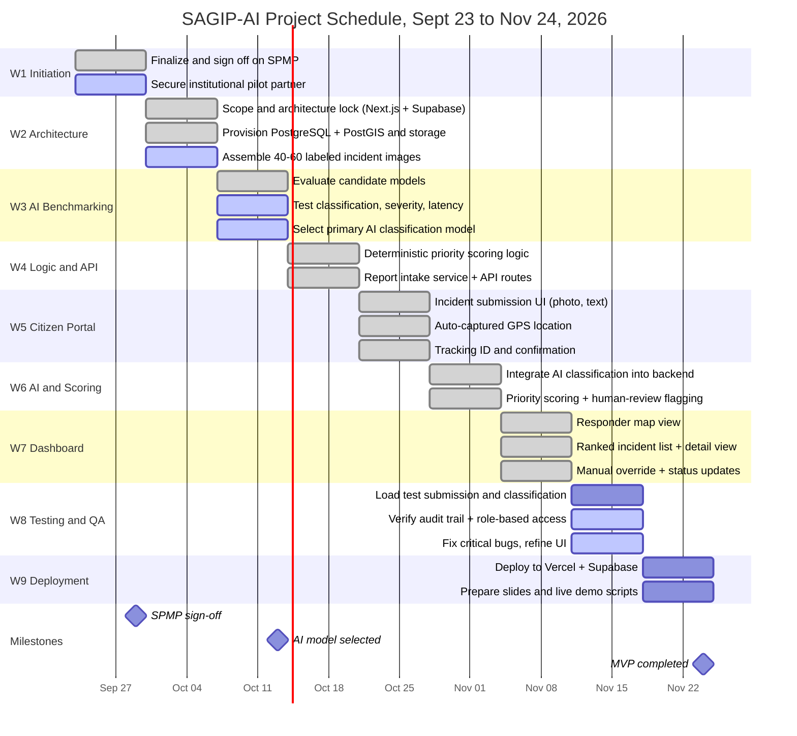

# SAGIP-AI — Project Documentation

> **Status:** Implemented and in testing, targeting the demonstration in November 2026. The citizen portal, responder dashboard, API, AI classification chain and priority scoring are built; the current UI is a temporary wireframe for testing. Sections still marked *(proposed)* or *(v1.5)* are not built yet.
> Originally drafted from the *SAGIP-AI Project Documentation* (CCRVIBE 2.0, September 03, 2026).
> Diagrams are written in [Mermaid](https://mermaid.js.org/) and render directly on GitHub.

## Table of Contents
1. [Feature Information](#1-feature-information)
2. [Project Information](#2-project-information)
3. [Overview](#3-overview)
4. [User Flow](#4-user-flow)
5. [User Interface & Features Breakdown](#5-user-interface--features-breakdown)
6. [Core Concepts](#6-core-concepts)
7. [System Architecture](#7-system-architecture)
8. [Design System](#8-design-system)
9. [Data Model](#9-data-model)
10. [API Endpoints](#10-api-endpoints)
11. [Data Sources & Seeding](#11-data-sources--seeding)
12. [Frontend Architecture](#12-frontend-architecture)
13. [Backend Implementation](#13-backend-implementation)
14. [Setup & Configuration](#14-setup--configuration)
15. [Common Tasks](#15-common-tasks)
16. [Known Issues, Caveats & Open Questions](#16-known-issues-caveats--open-questions)
17. [Quick Reference for the Next Developer](#17-quick-reference-for-the-next-developer)
18. [Project Schedule (Gantt Chart)](#18-project-schedule-gantt-chart)
19. [Appendix A — Future Enhancements](#appendix-a--future-enhancements)
20. [Appendix B — AI Classification Benchmarking Plan](#appendix-b--ai-classification-benchmarking-plan)
21. [Appendix C — Documentation Checklist](#appendix-c--documentation-checklist)

---

## 1. Feature Information

| Field | Value |
|-------|-------|
| **Feature / Product** | SAGIP-AI — Smart AI for Geospatial Intelligence and Prediction |
| **Type** | Mobile-first citizen web portal + desktop responder/admin dashboard |
| **Status** | Implemented, in testing (November 2026 demonstration) |
| **Course / Event** | CCRVIBE 2.0 |
| **Instructor** | Rex A. Seadiño Jr. |
| **Primary users** | Citizens reporting emergencies (fire, flood, accident, structural damage, medical, etc.) |
| **Secondary users** | Responders / field teams, admins / dispatch, LGU / DRRMO |
| **Frontend + API** | Next.js (App Router), TypeScript |
| **Database** | Supabase (PostgreSQL + PostGIS). Schema in `supabase/migrations/*.sql`, accessed with `@supabase/supabase-js` |
| **Storage / Auth** | Supabase Storage (report photos), Supabase Auth (role-based, responders/admins only) |
| **AI** | Gemini free tier (`gemini-3.1-flash-lite` primary, `gemini-3.5-flash` fallback) plus our own local ONNX image classifier. `claude` and `llama` providers exist in code but are not configured. Free tiers only, no paid APIs |
| **Maps** | Custom SVG map in `src/components/dashboard/IncidentMap.tsx` (no map library). Incident detail links out to OpenStreetMap |
| **Hosting** | Vercel (app) + Supabase (DB, storage, auth) |
| **Architecture style** | Modular monolith |
| **Key flow** | Citizen reports → AI classifies → human review if flagged → priority score → ranked on responder dashboard |

---

## 2. Project Information

### Repository
| Field | Value |
|-------|-------|
| **Repository** | [github.com/helidastar/SAGIP-AI](https://github.com/helidastar/SAGIP-AI) |
| **Default branch** | `main` |
| **Documentation** | `docs/DOCUMENTATION.md` (this file) on `main` |

### Branches
| Branch | Purpose | Status |
|--------|---------|--------|
| `main` | Stable, reviewed work. **Protected:** changes require a pull request with one approval; force-pushes and deletion are blocked. | Active |
| `development` | Integration branch. All feature branches merge here first. | Active |
| `feat/ai` | AI classifier, providers, benchmark, dataset tools, training notebook | Active |
| `feat/UI` | Citizen portal and responder dashboard | Active |
| `feat/backend` | Supabase schema, API routes, staff scripts | Active |
| `feat/docs` | Documentation | Active |

**Branch flow:** `feat/<area> → development → main` (via pull requests).

### Contributors
| Name | GitHub |
|------|--------|
| Charity Ricabo | [@helidastar](https://github.com/helidastar) |
| Maria Mhikyla Jayno | [@mhiksNmatch](https://github.com/mhiksNmatch) |
| Reign Marie Hamo-ay | [@Reignnnh04](https://github.com/Reignnnh04) |
| John Vincent Fabroa | [@Beynsz](https://github.com/Beynsz) |

### Commit history
See [the commit history on GitHub](https://github.com/helidastar/SAGIP-AI/commits/development). Commit messages follow `type(scope): what changed`, for example `feat(ai): add local onnx classifier provider`.

---

## 3. Overview

### 3.1 Problem statement
Emergency and incident reports from citizens (fires, floods, accidents, structural damage, medical emergencies, etc.) arrive through scattered, informal channels — phone calls, social media, word of mouth. Responders have **no unified, prioritized view** of what is happening where, which incidents are most urgent, and how severe each one actually is. This slows response and makes it hard to allocate limited responder resources to the incidents that need them most.

### 3.2 Goals
- Give citizens **one simple channel** to report an emergency with photo, description, and location.
- **Automatically classify** and estimate the severity of each report using AI, so incidents don't sit unreviewed.
- **Rank incidents** by a transparent priority score (severity, affected population, location, incident type) so responders act on what matters most first.
- Give responders/admins a **live dashboard**: map view, ranked incident list, assignment, and status tracking.
- Keep the AI **assistive, not authoritative** — flag high-severity or low-confidence cases for human review instead of auto-dispatching on AI output alone.

### 3.3 Success looks like
- A citizen can submit a report in **under a minute**, from a phone, with minimal typing.
- A responder can see a ranked, map-based view of open incidents and **understand why** something is ranked where it is.
- The AI classification is accurate enough that responders **trust the ranking** instead of falling back to manual triage.

### 3.4 Stakeholders
| Stakeholder | Interest / role | What they need from the system |
|-------------|-----------------|--------------------------------|
| Citizens (reporters) | Submit and track incident reports | Fast, simple reporting; confirmation their report was seen |
| Responders / field teams | Act on incidents | Accurate priority ranking, clear location, current status |
| Admins / dispatch | Oversee and assign incidents | Dashboard, analytics, ability to override AI ranking |
| LGU / DRRMO or campus safety office | Institutional owner / pilot partner | Reliability, auditability, no legal exposure from bad AI calls |
| Development team | Build and maintain the system | Clear scope, feasible timeline, defensible AI design decisions |
| Academic panel / adviser | Evaluate the project | Demonstrated technical soundness of the AI component |

### 3.5 Scope & prioritization
| Priority | Items |
|----------|-------|
| **Must-have (v1 / MVP)** | Citizen report submission (location plus photo and/or description) · AI classification (type + severity + confidence + hoax flag) · Deterministic, explainable priority score · Responder dashboard (ranked list + basic map + status update) · Human review flag for high-severity / low-confidence / suspected-hoax cases · Citizen status tracking by tracking code *(built)* · Team assignment *(built)* |
| **Should-have (v1.5)** | Advanced assignment workflow · Basic analytics (volume by type / time / location; the Analytics page is a placeholder) |
| **Nice-to-have (later)** | Duplicate report clustering · Offline-first submission queue · Safety guidance per incident type · Two-tier AI escalation for ambiguous cases |

> **Recommended first build target:** the AI classification + priority scoring pipeline is the actual innovation. Build just enough of the portal and dashboard to prove the pipeline works end to end on real submissions.

### 3.6 Feasibility summary
| Area | Rating | Notes |
|------|--------|-------|
| Technical | **High** | All components are off-the-shelf (vision-LLM API, weighted formula, map dashboard, web form). Risk is integration and scope, not research. |
| Operational | **Medium** | Needs a real pilot partner, responder trust in the ranking, and a staffing plan for reviewing flagged cases. |
| Financial | **No AI cost** | Free tiers only (Gemini free tier and our own local model, no billing account linked); development time is the main cost. |
| Legal / liability | **Needs care** | An AI misranking a serious incident is a liability issue — mitigated by design via human-in-the-loop review. |

---

## 4. User Flow

### 4.1 Core loop


```mermaid
flowchart TD
    A[Citizen witnesses an incident] --> B[Opens SAGIP-AI citizen portal]
    B --> C["Submits photo and/or short description + GPS location"]
    C --> D[Receives tracking ID]
    C --> E[AI classifies: type, severity, confidence, hazards, hoax flag]
    E --> F{"Low confidence OR high/critical severity OR suspected hoax?"}
    F -- yes --> G[Human review queue]
    G --> H[Responder confirms or corrects]
    H --> I[Priority scoring]
    F -- no --> I
    I --> J[Ranked on responder dashboard + map]
    J --> K[Admin assigns responder/team]
    K --> L[Status updates: in progress → resolved]
    L --> M[Citizen sees updated status via tracking ID]
```

### 4.2 Report status lifecycle


```mermaid
stateDiagram-v2
    [*] --> received: citizen submits
    received --> classified: AI confident, severity low/moderate
    received --> pending_review: low confidence OR high/critical OR suspected hoax
    pending_review --> classified: responder confirms / corrects
    classified --> assigned: admin assigns team
    assigned --> in_progress: responder en route / on site
    in_progress --> resolved
    received --> rejected: spam / invalid
    pending_review --> rejected: spam / invalid
    resolved --> [*]
    rejected --> [*]
```

Citizen-facing labels collapse these into: **Received → Under review → Responder assigned → Resolved**.

---

## 5. User Interface & Features Breakdown

Two distinct interfaces, one shared design system (see [Section 8](#8-design-system)).

### 5.1 Citizen portal (mobile-first, no account required)
| Screen | Contents |
|--------|----------|
| **Report incident** | Camera / photo upload, short text description, GPS location auto-captured (editable pin on map), submit button |
| **Confirmation** | Reference / tracking ID, current status, "save this ID" hint |
| **Track report** | Enter tracking ID → status timeline (Received → Under review → Responder assigned → Resolved) |
| **Safety guidance** *(stretch)* | Basic do's and don'ts based on the incident type |

Design priorities: minimal steps, large touch targets, plain language, works on low-end phones and weak connections.

### 5.2 Responder / admin dashboard (desktop, authenticated)
| View | Contents |
|------|----------|
| **Ranked incident list** | Open incidents sorted by priority score; severity color chip, type, location, age, status, "needs review" badge; manual override of rank |
| **Map view** | Live incident markers colored by severity (same scale as the list); click marker → incident detail |
| **Incident detail** | Photo, description, AI output (type, severity, confidence, hazards), **priority score breakdown** (why it ranked here), audit history, assign + status controls |
| **Review queue** | Flagged reports (low confidence / high severity / "Possible hoax") awaiting confirmation or correction |
| **Analytics** *(v1.5)* | Volume over time, by type, by location; response-time tracking |
| **Definitions / legend** | Explains severity tiers, priority bands, and scoring weights so responders can interpret rankings |

---

## 6. Core Concepts

### 6.1 Incident types
`fire`, `flood`, `landslide` (incl. soil erosion), `road_accident`, `structural_damage` (incl. collapse), `medical_emergency`, `fallen_debris` (trees / debris), `other`.

### 6.2 Severity tiers
| Tier | Value | Color token | Meaning (guideline) |
|------|-------|-------------|---------------------|
| **Low** | 1 | `--sev-low` (green) | Minor, no immediate danger to life |
| **Moderate** | 2 | `--sev-moderate` (yellow) | Property damage or potential danger; response needed soon |
| **High** | 3 | `--sev-high` (orange) | Active danger to people or major property; urgent |
| **Critical** | 4 | `--sev-critical` (red) | Life-threatening, mass-casualty potential; immediate |

The same scale is used everywhere: list chips, map markers, detail view.

### 6.3 Hierarchy
```
Incident (one real-world event)
 └── Report(s)            ← citizen submissions (1 in MVP; many once duplicate clustering exists)
      ├── Classification  ← AI output (versioned, one per model run)
      ├── Review          ← human confirmation / correction (if flagged)
      └── Priority score  ← deterministic, computed from final classification + location data
```

### 6.4 AI-estimated vs. confirmed severity
- **AI severity** — what the vision-LLM returned. Stored as-is, never overwritten.
- **Confirmed severity** — what a responder set during review (or equals AI severity if no review was needed).
- The **priority score always uses the confirmed value**. Keeping both lets us measure AI accuracy over time and supports auditability.

### 6.5 Human review triggers
A report goes to `pending_review` if **any** of these is true (`needsReview()` in `src/lib/ai/review.ts`):

1. `confidence < CONFIDENCE_THRESHOLD` (initial value `0.70`, tuned after benchmarking),
2. AI severity is `high` or `critical`, or
3. the AI sets `hoaxSuspected` (unrelated meme, screenshot or stock photo, joking description, or a photo and description that do not match). A suspected hoax is **never rejected automatically**; reviewers see a "Possible hoax" tag. Stored in `classifications.hoax_suspected` (migration `0006_hoax_flag.sql`). The keyword matcher and the local image model always return `false`.

### 6.6 Priority score *(proposed — to be finalized in its own design doc)*
Deterministic, plain logic (not an LLM call), so every score is explainable:

```
priority = 100 × ( w_sev  × severity_norm
                 + w_pop  × population_norm
                 + w_loc  × location_risk_norm
                 + w_type × type_weight )

initial weights: w_sev = 0.45, w_pop = 0.25, w_loc = 0.15, w_type = 0.15
```
Each input is normalized to 0–1. The dashboard shows each term's contribution.

### 6.7 Priority bands
| Band | Score | Label |
|------|-------|-------|
| **P1** | 80–100 | Immediate |
| **P2** | 60–79 | Urgent |
| **P3** | 40–59 | Standard |
| **P4** | 0–39 | Low |

---

## 7. System Architecture

### 7.1 Architecture style
A **modular monolith**: one Next.js app with clearly separated modules. Faster to build, easier to debug, and easier for a small team to maintain than microservices. Revisit only if a module (e.g. AI classification) needs to scale independently.

### 7.2 High-level architecture


```mermaid
%%{init: {"flowchart": {"nodeSpacing": 25, "rankSpacing": 40, "padding": 8, "subGraphTitleMargin": {"top": 6, "bottom": 22}}, "themeVariables": {"fontSize": "14px"}}}%%
flowchart TB
    subgraph Users
        direction LR
        C([Citizen])
        R([Responder / Admin])
    end

    subgraph Presentation["Presentation Layer (Next.js on Vercel)"]
        direction LR
        CP[Citizen Portal]
        RT[Report Tracking]
        RD[Responder Dashboard]
    end

    subgraph Application["Application Layer (Next.js Route Handlers)"]
        direction TB
        API["/api/* routes"]
        IN[Report Intake]
        AS[Assignment & Status]
        AI[AI Classification]
        PS[Priority Scoring]
        AU[Audit Log]
    end

    subgraph Data["Data & AI Layer"]
        direction LR
        LLM["Vision-LLM API<br/>Gemini / Claude / GPT"]
        ST[("Supabase Storage<br/>report photos")]
        DB[("Supabase PostgreSQL<br/>+ PostGIS")]
        SA[Supabase Auth]
    end

    C --> CP & RT
    R --> RD
    CP & RT & RD --> API
    RD -. login .-> SA
    API --> IN & AS
    IN --> ST
    IN --> DB
    IN --> AI
    AI --> LLM
    AI --> PS
    PS --> DB
    AS --> DB
    IN & AI & PS & AS --> AU
    AU --> DB
```

### 7.3 Report intake sequence


```mermaid
sequenceDiagram
    actor Citizen
    participant UI as Citizen Portal
    participant API as Next.js API
    participant IN as Intake Module
    participant ST as Supabase Storage
    participant DB as Supabase DB
    participant AI as AI Classifier

    Citizen->>UI: Photo + description + location
    UI->>API: POST /api/reports
    API->>ST: Upload photo
    API->>IN: Create report
    IN->>DB: Insert report (status: received)
    IN->>AI: Classify(photo, text)
    AI-->>IN: type, severity, confidence, hazards
    alt confidence low OR severity high/critical
        IN->>DB: status = pending_review
    else confident
        IN->>DB: status = classified
    end
    IN-->>API: report id + tracking code + status
    API-->>UI: 201 Created
    UI-->>Citizen: Show tracking ID and status
```

### 7.4 Classification, review & ranking sequence


```mermaid
sequenceDiagram
    actor Responder
    participant RD as Responder Dashboard
    participant API as Next.js API
    participant AI as AI Classifier
    participant LLM as Vision-LLM API
    participant PS as Priority Scoring
    participant DB as Supabase DB

    API->>AI: New report (photo + text)
    AI->>LLM: Classify incident (fixed prompt, JSON schema)
    LLM-->>AI: type, severity, confidence, hazards
    AI->>AI: Check confidence threshold & severity
    alt needs human review
        AI->>DB: Add to review queue
        DB-->>RD: Show flagged report
        Responder->>RD: Confirm or correct classification
        RD->>API: POST /api/reports/{id}/review
        API->>DB: Save confirmed classification
        API->>PS: Score report
    else confident
        AI->>PS: Pass classification to scoring
    end
    PS->>DB: Fetch population + location risk
    DB-->>PS: Location data
    PS->>PS: Compute priority score + band
    PS->>DB: Save score + breakdown
    DB-->>RD: Update ranked list (Realtime)
    RD-->>Responder: Ranked incidents on list + map
```

### 7.5 Deployment


```mermaid
flowchart LR
    Dev[Developer] -- push --> GH[GitHub: helidastar/SAGIP-AI]
    GH -- main --> VP[Vercel Production]
    GH -- PR / development --> VPr[Vercel Preview]
    VP & VPr --> SB[(Supabase project)]
    VP --> LLM[Vision-LLM API]
```

### 7.6 Key design decisions
- **AI classification is swappable** — a provider-agnostic interface, not hard-wired to one vendor's SDK, so the model can change based on benchmarking.
- **Priority scoring is separate and deterministic** — plain, auditable code so anyone can see why an incident got its score.
- **Human review is a first-class status** in the data model, not an afterthought.
- **Citizens submit without an account** — speed during an emergency beats data completeness.
- **PostGIS from day one** — geo-queries ("incidents near X") are core to the map and ranking.

---

## 8. Design System

Both surfaces share one set of tokens (color, typography, components) even though their layouts differ.

### 8.1 Colors (temporary test UI)
The current interface follows the team's initial wireframe sketch: black and white, square-cornered
boxed panels and mono uppercase labels. It exists so the backend can be tested and demonstrated;
the final visual design is still being worked on. Tokens are defined in `src/app/globals.css`.

| Token | Value | Use |
|-------|-------|-----|
| `--foreground` / `--background` | `#111111` / `#ffffff` | Text and page background |
| `--line` | `#111111` | Panel borders |
| `--muted` / `--faint` / `--grid` | greys | Secondary text, dividers, map grid |
| `--sev-low` `--sev-moderate` `--sev-high` `--sev-critical` | green, amber, orange, red | Severity, the only colors kept |

Severity is never conveyed by color alone — always pair with a label. High and critical are also
filled rather than outlined, so they stand out in a monochrome interface.

### 8.2 Typography & layout
- System / Inter font stack, large base size on citizen portal (≥ 16px) for readability under stress.
- Citizen portal: single-column, one primary action per screen.
- Dashboard: dense two-pane layout (ranked list + map), detail in a side panel.

### 8.3 Reusable components
`SeverityChip`, `PriorityBadge`, `StatusPill`, `ReviewBadge`, `IncidentCard`, `IncidentMarker`, `ScoreBreakdown`, `PhotoUploader`, `LocationPicker`, `StatusTimeline`, `DefinitionsModal`.

---

## 9. Data Model

### 9.1 Entity relationship diagram (Supabase PostgreSQL + PostGIS)


```mermaid
%%{init: {"er": {"layoutDirection": "TB", "entityPadding": 10, "minEntityWidth": 90}, "themeVariables": {"fontSize": "14px"}}}%%
erDiagram
    direction TB
    AREAS ||--o{ REPORTS : contains
    REPORTS ||--o{ CLASSIFICATIONS : "classified by"
    REPORTS ||--o| PRIORITY_SCORES : "scored as"
    REPORTS ||--o| REVIEWS : "reviewed in"
    REPORTS ||--o{ ASSIGNMENTS : "assigned via"
    REPORTS ||--o{ AUDIT_LOGS : "tracked by"
    PROFILES ||--o{ REVIEWS : performs
    PROFILES }o--o| TEAMS : "member of"
    TEAMS ||--o{ ASSIGNMENTS : receives

    REPORTS {
        uuid id PK
        text tracking_code UK
        text description
        text photo_path
        geography location
        uuid area_id FK
        text status
        text confirmed_type
        text confirmed_severity
        timestamptz created_at
        timestamptz updated_at
    }
    CLASSIFICATIONS {
        uuid id PK
        uuid report_id FK
        text model
        text incident_type
        text severity
        numeric confidence
        text[] hazards
        boolean hoax_suspected
        jsonb raw_response
        int latency_ms
        numeric cost_usd
        timestamptz created_at
    }
    REVIEWS {
        uuid id PK
        uuid report_id FK
        uuid reviewer_id FK
        text final_type
        text final_severity
        text notes
        timestamptz created_at
    }
    PRIORITY_SCORES {
        uuid report_id PK
        numeric score
        text band
        jsonb breakdown
        boolean overridden
        timestamptz computed_at
    }
    ASSIGNMENTS {
        uuid id PK
        uuid report_id FK
        uuid team_id FK
        uuid assigned_by FK
        timestamptz assigned_at
    }
    TEAMS {
        uuid id PK
        text name
    }
    PROFILES {
        uuid id PK
        text full_name
        text role
        uuid team_id FK
    }
    AREAS {
        uuid id PK
        text name
        int population
        numeric risk_index
        geography boundary
    }
    AUDIT_LOGS {
        uuid id PK
        uuid report_id FK
        uuid actor_id
        text action
        jsonb before
        jsonb after
        timestamptz created_at
    }
```

### 9.2 Tables
| Table | Purpose |
|-------|---------|
| `reports` | One citizen submission. `status` ∈ `received`, `pending_review`, `classified`, `assigned`, `in_progress`, `resolved`, `rejected`. |
| `classifications` | Every AI run (append-only), including raw model output, latency, cost, and `hoax_suspected` — for auditability and benchmarking. |
| `reviews` | Human confirmation/correction of a flagged report. |
| `priority_scores` | Current score, band, per-term breakdown, and whether an admin overrode it. |
| `assignments` | Report → team assignments (history kept). |
| `teams` / `profiles` | Responder teams and staff accounts (`profiles.id` = `auth.users.id`; `role` ∈ `responder`, `admin`). |
| `areas` | Barangay / zone polygons with population and risk index, used by scoring. |
| `audit_logs` | Every status change, override, and review — who, what, before/after. |

### 9.3 Security (Supabase RLS)
- **Anonymous** citizens: `INSERT` on `reports` only (via API route), and read a single report's public status by `tracking_code`.
- **Responders / admins**: read all reports; responders update status on assigned reports; admins can assign, override scores, and manage teams.
- Photos are in a **private bucket**; the dashboard uses short-lived signed URLs.

---

## 10. API Endpoints

Implemented as Next.js Route Handlers under `src/app/api`.

### 10.1 Citizen (public)
| Method | Route | Description |
|--------|-------|-------------|
| `POST` | `/api/reports` | Submit a report (multipart: photo, description, lat, lng) |
| `GET` | `/api/reports/track/{trackingCode}` | Public status of a report |

### 10.2 Responder / admin (authenticated)
| Method | Route | Description |
|--------|-------|-------------|
| `GET` | `/api/incidents?status=&band=&type=` | Ranked incident list |
| `GET` | `/api/incidents/{id}` | Detail incl. classifications, score breakdown, audit log |
| `GET` | `/api/incidents/map?bbox=` | GeoJSON of open incidents within a bounding box |
| `GET` | `/api/review-queue` | Reports in `pending_review` |
| `POST` | `/api/reports/{id}/review` | Confirm / correct classification |
| `PATCH` | `/api/incidents/{id}/status` | Update status |
| `POST` | `/api/incidents/{id}/assign` | Assign to a team *(admin)* |
| `PATCH` | `/api/incidents/{id}/priority` | Manually override score / band *(admin)* |
| `POST` | `/api/incidents/{id}/reclassify` | Re-run AI classification *(admin)* |
| `GET` | `/api/analytics/summary?from=&to=` | Volume by type / time / area, response times *(v1.5)* |

### 10.3 Example responses

`POST /api/reports` → `201 Created`
```json
{
  "id": "6f1c2e0a-5b7d-4a1e-9d3f-2c8b1a7e4f90",
  "trackingCode": "SGP-7K3Q9D",
  "status": "pending_review",
  "message": "Report received. Save your tracking code to check its status."
}
```

`GET /api/reports/track/SGP-7K3Q9D` → `200 OK`
```json
{
  "trackingCode": "SGP-7K3Q9D",
  "status": "assigned",
  "publicStatus": "Responder assigned",
  "incidentType": "flood",
  "updatedAt": "2026-09-11T08:42:10Z"
}
```

`GET /api/incidents/{id}` → `200 OK`
```json
{
  "id": "6f1c2e0a-5b7d-4a1e-9d3f-2c8b1a7e4f90",
  "status": "classified",
  "location": { "lat": 10.3157, "lng": 123.8854, "area": "Barangay Lahug" },
  "classification": {
    "model": "primary:gemini-3.1-flash-lite",
    "incidentType": "flood",
    "severity": "high",
    "confidence": 0.82,
    "hazards": ["rising water", "stranded vehicles"]
  },
  "review": { "finalSeverity": "high", "reviewer": "J. Dela Cruz" },
  "priority": {
    "score": 78.4,
    "band": "P2",
    "breakdown": { "severity": 33.8, "population": 21.5, "locationRisk": 11.1, "type": 12.0 },
    "overridden": false
  }
}
```

---

## 11. Data Sources & Seeding

### 11.1 Sources
| Data | Source |
|------|--------|
| Incident types, severity tiers, weights | `src/lib/constants.ts` |
| Areas (barangay boundaries, population) | PSA census population data + barangay boundary GeoJSON (from pilot LGU / open data) |
| Location risk index | LGU / DRRMO hazard maps (flood, landslide), set per area |
| Demo teams & staff | Seed script (test accounts only) |
| Benchmark images | 40–60 labeled Philippine incident photos (see [Appendix B](#appendix-b--ai-classification-benchmarking-plan)) |

### 11.2 Seed script
`npm run seed` → `scripts/seed.mjs` loads teams and areas into Supabase. It reads `scripts/data/areas.sample.geojson` by default; pass another GeoJSON path as an argument to use real barangay boundaries.

### 11.3 Idempotent process
- The seed uses `upsert` keyed on natural keys (area `name`, team `name`) so re-running it never duplicates rows.
- Test reports are created through the app and can be deleted from the Supabase table editor; deleting a report cascades to its classifications and audit logs.

---

## 12. Frontend Architecture

### 12.1 Folder structure (Next.js App Router)
```
src/
├── app/
│   ├── (citizen)/
│   │   ├── page.tsx               # Report incident
│   │   ├── submitted/page.tsx     # Confirmation + tracking ID
│   │   └── track/page.tsx         # Track report status
│   ├── (dashboard)/dashboard/
│   │   ├── page.tsx               # Ranked list + map
│   │   ├── incidents/[id]/page.tsx
│   │   ├── review/page.tsx        # Review queue
│   │   └── analytics/page.tsx
│   ├── login/page.tsx
│   └── api/                       # Route handlers (Section 10)
├── components/
│   ├── citizen/                   # PhotoUploader, LocationPicker, StatusTimeline
│   ├── dashboard/                 # IncidentList, IncidentMap, ScoreBreakdown
│   └── ui/                        # SeverityChip, PriorityBadge, StatusPill, DefinitionsModal
├── lib/
│   ├── ai/                        # classifier interface + providers (gemini, claude, llama, local, keyword)
│   ├── reports/                   # intake, classification, scoring helpers
│   ├── scoring/                   # priority formula + banding
│   ├── supabase/                  # admin + server clients
│   ├── api-client.ts              # browser fetch helper
│   ├── auth.ts                    # staff session guards
│   ├── rate-limit.ts
│   ├── workflow.ts                # workflow steps shown in the dashboard
│   └── constants.ts
└── types/
```

### 12.2 Styling
- Tailwind CSS with design tokens from [Section 8](#8-design-system) exposed as CSS variables.
- Map: a dependency-free SVG scatter plot (`src/components/dashboard/IncidentMap.tsx`) that plots open incidents on a plain grid; filled markers are high or critical severity. Incident detail links out to OpenStreetMap for the exact location.
- Citizen pages must stay lightweight (compress photos client-side to ~1000×1000 px before upload — also cuts AI token cost).

---

## 13. Backend Implementation

### 13.1 AI classifier module (`src/lib/ai/`)
```ts
export interface IncidentClassification {
  incidentType: IncidentType;
  severity: Severity;
  confidence: number;      // 0–1
  hazards: string[];
  hoaxSuspected: boolean;  // flags for review only, never auto-rejects
}

export interface Classifier {
  model: string;
  classify(input: { image?: { data: Buffer; mimeType: string }; description: string },
           options?: { signal?: AbortSignal }): Promise<ClassifierResult>;
}
```
Every provider implements the same interface; `AI_PROVIDER` picks the primary and `AI_FALLBACK_PROVIDER` the fallback.

| Provider | File | Cost | Status |
|---|---|---|---|
| `gemini` | `gemini.ts` | Free tier (daily reset) | **In use** (primary + fallback) |
| `local` | `local.ts` | Free, runs on our server (ONNX) | Trained 2026-09-23 (79.8% test accuracy, 41 ms per photo); not yet the primary, pending the benchmark against Gemini |
| `claude` | `claude.ts` | Paid only | Not configured |
| `llama` | `llama.ts` | Needs credits on current hosts | Not configured (see AI log 2026-09-21) |
| keyword matcher | `keyword.ts` | Free | Always the last step |

API providers share one prompt and JSON schema (`prompt.ts`), and output is validated by `normalizeClassification()`. The `local` provider is our own image model (trained with `training/sagip_classifier_colab.ipynb`). It predicts only the incident type from the photo; severity and hazards come from the description keywords.

**Chain (`chain.ts`):** primary → retry once on 429/5xx/timeout → fallback → keyword matcher. When the primary is `local`, answers below `CONFIDENCE_THRESHOLD` are **escalated** to the fallback for a second opinion. If that fails, the local answer is kept and goes to human review.

### 13.2 Constants (`src/lib/constants.ts`)
```ts
export const INCIDENT_TYPES = [
  "fire", "flood", "landslide", "road_accident",
  "structural_damage", "medical_emergency", "fallen_debris", "other",
] as const;

export const SEVERITY = { low: 1, moderate: 2, high: 3, critical: 4 } as const;

export const CONFIDENCE_THRESHOLD = 0.7;
export const REVIEW_SEVERITIES = ["high", "critical"];

export const PRIORITY_WEIGHTS = { severity: 0.45, population: 0.25, locationRisk: 0.15, type: 0.15 };

export const TYPE_WEIGHTS: Record<IncidentType, number> = {
  fire: 1.0, medical_emergency: 1.0, structural_damage: 0.9, flood: 0.85,
  landslide: 0.85, road_accident: 0.8, fallen_debris: 0.5, other: 0.4,
};
```

### 13.3 Priority banding (`src/lib/scoring/`)
```ts
export const PRIORITY_BANDS = [
  { band: "P1", min: 80, label: "Immediate" },
  { band: "P2", min: 60, label: "Urgent" },
  { band: "P3", min: 40, label: "Standard" },
  { band: "P4", min: 0,  label: "Low" },
] as const;

export function toBand(score: number) {
  return PRIORITY_BANDS.find((b) => score >= b.min)!;
}
```
`computePriority()` returns both the score and the per-term breakdown, which is stored in `priority_scores.breakdown`.

---

## 14. Setup & Configuration

> Applies once the app is scaffolded on `development`.

### 14.1 Prerequisites
- Node.js 20+ and npm
- Git
- A Supabase project (PostGIS extension enabled)
- An API key for the chosen vision-LLM provider
- *(optional)* Supabase CLI for local development

### 14.2 Environment variables (`.env.local`)
```bash
NEXT_PUBLIC_SUPABASE_URL=https://<project>.supabase.co
NEXT_PUBLIC_SUPABASE_ANON_KEY=<anon-key>
SUPABASE_SERVICE_ROLE_KEY=<service-role-key>   # server only, never expose
DATABASE_URL=postgresql://...                  # pooled connection (SQL tools)
DIRECT_URL=postgresql://...                    # direct connection for migrations
AI_PROVIDER=gemini                             # gemini | local | claude | llama | mock
AI_API_KEY=<provider-key>                      # not needed for local
AI_MODEL=gemini-3.1-flash-lite                 # for local: path to the .onnx file
AI_FALLBACK_PROVIDER=gemini
AI_FALLBACK_API_KEY=<provider-key>
AI_FALLBACK_MODEL=gemini-3.5-flash
CONFIDENCE_THRESHOLD=0.7
```
See `.env.example` for the full list (timeouts, base URLs, daily budget, rate limit).
Never commit `.env.local`.

### 14.3 Database init
```bash
git clone https://github.com/helidastar/SAGIP-AI.git
cd SAGIP-AI
git checkout development
npm install
npm run seed
```
In Supabase: enable `postgis`, run the SQL files in `supabase/migrations/` in order (SQL Editor or the Supabase CLI), and create a private `report-photos` bucket. Row-level security policies are part of those migrations.

### 14.4 Running
```bash
npm run dev      # http://localhost:3000
npm run build
npm run start
npm run lint
```

---

## 15. Common Tasks

### 15.1 Add a new incident type
1. Add it to `INCIDENT_TYPES` and `TYPE_WEIGHTS` in `src/lib/constants.ts`.
2. Update the classifier prompt and JSON schema in `src/lib/ai/`.
3. Add an icon/label in `DefinitionsModal` and the map legend.
4. Add benchmark images for it and re-run the benchmark.

### 15.2 Update a definition (severity, band, legend text)
Edit `src/lib/constants.ts` / `src/lib/scoring/`, then update the `DefinitionsModal` copy and [Section 6](#6-core-concepts) of this document together.

### 15.3 Adjust the confidence threshold or priority weights
Change `CONFIDENCE_THRESHOLD` or `PRIORITY_WEIGHTS`. Document the reason (e.g. benchmark results) in the PR. Existing scores are not recalculated automatically — run `npm run scores:recompute` if needed.

### 15.4 Link a responder to a team / make someone an admin
Create the user in Supabase Auth, then set `profiles.role` (`responder` or `admin`) and `profiles.team_id`.

### 15.5 Switch AI provider
Set `AI_PROVIDER` and `AI_API_KEY`. The `classifications.model` column records which model and chain step produced each result (e.g. `primary:gemini-3.1-flash-lite`, `escalation:gemini-3.5-flash`, `keyword-fallback`).

To use our own model: train it with `training/sagip_classifier_colab.ipynb`, put `sagip-classifier.onnx` and `labels.json` in `models/`, then set `AI_PROVIDER=local` (no key). Keep Gemini as the fallback so unsure answers get a second opinion.

### 15.6 Add a new area
Add the polygon, population, and risk index to the GeoJSON passed to the seed script (`scripts/data/areas.sample.geojson` by default) and re-run `npm run seed` (idempotent).

---

## 16. Known Issues, Caveats & Open Questions

### 16.1 Open questions
- **No named pilot partner yet** (barangay, city DRRMO, or campus safety office). Without one, there are no real incidents to rank. Resolve early.
- **Who staffs the review queue in real time?** This is a process and staffing question, not only a software one.
- **Final priority formula** — the weights in [6.6](#66-priority-score-proposed--to-be-finalized-in-its-own-design-doc) are placeholders until a model is chosen and benchmarked.

### 16.2 Risk register
Matches the team's Risk Log spreadsheet (as of 2026-09-28). Rating = Likelihood × Impact (Low = 1, Low–Medium = 1.5, Medium = 2, High = 3); 6 or more is High, 3 or more is Medium.

| ID | Risk | Likelihood | Impact | Rating | Mitigation | Status |
|----|------|------------|--------|--------|------------|--------|
| R-001 | AI misclassifies a high-severity incident as low priority | Medium | High | High | Human review for low-confidence, high/critical and suspected-hoax reports; dispatch is never automated | Monitoring |
| R-002 | No institutional pilot partner / no real users | Medium | High | High | Secure an LGU, DRRMO or campus partner before heavy build investment | Open |
| R-003 | Responders don't trust the AI ranking | Medium | Medium | Medium | Transparent formula, visible score breakdown, manual override | Open |
| R-004 | System overload during a disaster spike | Low–Medium | High | Medium | Background classification, per-IP rate limit, managed hosting; load test pending | Open |
| R-005 | Scope creep across 4 bundled sub-products | High | Medium | High | Hold to MVP scope in [3.5](#35-scope--prioritization) | Open |
| R-006 | AI vendor pricing / availability changes (happened: `gemini-2.5-flash` withdrawn, free Llama vision removed) | High | Medium | High | Swappable providers (Gemini, Claude, Llama, local) with retry, fallback and keyword matcher | Monitoring |
| R-007 | Free-tier AI quota runs out during testing, a spike or the demo | Medium | High | High | Separate-quota fallback model, keyword matcher to review, plan to make the local model primary | Monitoring |
| R-008 | Training data gaps and bias (no road accident / fallen debris photos, few medical, mostly aerial floods) | High | Medium | High | Dataset cleaning, held-out benchmark photos, low confidence to review; collect own photos | Open |
| R-009 | Hoax or prank reports classified automatically | Medium | High | High | `hoaxSuspected` flag sends them to review (never auto-rejected); rate limit | Monitoring |
| R-010 | AI accuracy not validated before the demo | Medium | High | High | Label benchmark severities, run `npm run benchmark` for local vs Gemini | Open |
| R-011 | Citizen data or admin functions exposed | Low | High | Medium | RLS, private bucket, staff auth, admin functions locked (migration 0005); 42/42 checks passed | Mitigated |
| R-012 | Unexpected AI API charges | Low | Medium | Low | Free-only rule, no billing linked; add Gemini prices so the budget cap counts them | Mitigated |
| R-013 | Local model files (~20 MB, git-ignored) missing at deployment | Medium | Medium | Medium | Copies in shared Drive, label check at load time, deployment checklist step | Open |

### 16.3 Technical caveats
- AI classification is **assistive** — the UI must always show that a score came from AI and whether it was human-confirmed.
- Serverless functions have time limits; keep classification under a few seconds or move it to a background job/queue if latency grows.
- Phone photos are large — resize client-side before upload.
- Citizens have no account, so tracking relies on the tracking code; treat it as a bearer secret (no personal data on the public status page).

---

## 17. Quick Reference for the Next Developer

| Need to… | Go to |
|----------|-------|
| Understand the product | [Section 3](#3-overview) |
| See how data flows | [Section 7](#7-system-architecture) |
| Change severity / weights / thresholds | `src/lib/constants.ts` |
| Change the scoring formula | `src/lib/scoring/` |
| Change / add an AI provider | `src/lib/ai/` |
| Change the DB schema | add a file in `supabase/migrations/` and run it in Supabase |
| Seed data | `npm run seed` |
| API contract | [Section 10](#10-api-endpoints) |

**Rules of thumb**

1. Never let AI output skip human review for high/critical cases.
2. Keep scoring deterministic — no LLM calls inside `scoring/`.
3. Log every override and status change to `audit_logs`.
4. Same severity colors everywhere.
5. Keep the citizen flow under a minute on a low-end phone.
6. Work on a feature branch → PR into `development` → PR into `main`.

---

## 18. Project Schedule (Gantt Chart)

Planned schedule from the SPMP (Section 4.2): nine one-week phases from September 23 to November 24, 2026, ending with the MVP demonstration.


```mermaid
gantt
    title SAGIP-AI Project Schedule, Sept 23 to Nov 24, 2026
    dateFormat YYYY-MM-DD
    axisFormat %b %d
    section W1 Initiation
    Finalize and sign off on SPMP                  :done, w11, 2026-09-23, 7d
    Secure institutional pilot partner             :active, w12, 2026-09-23, 7d
    section W2 Architecture
    Scope and architecture lock (Next.js + Supabase) :done, w21, 2026-09-30, 7d
    Provision PostgreSQL + PostGIS and storage     :done, w22, 2026-09-30, 7d
    Assemble 40-60 labeled incident images         :active, w23, 2026-09-30, 7d
    section W3 AI Benchmarking
    Evaluate candidate models                      :done, w31, 2026-10-07, 7d
    Test classification, severity, latency         :active, w32, 2026-10-07, 7d
    Select primary AI classification model         :active, w33, 2026-10-07, 7d
    section W4 Logic and API
    Deterministic priority scoring logic           :done, w41, 2026-10-14, 7d
    Report intake service + API routes             :done, w42, 2026-10-14, 7d
    section W5 Citizen Portal
    Incident submission UI (photo, text)           :done, w51, 2026-10-21, 7d
    Auto-captured GPS location                     :done, w52, 2026-10-21, 7d
    Tracking ID and confirmation                   :done, w53, 2026-10-21, 7d
    section W6 AI and Scoring
    Integrate AI classification into backend       :done, w61, 2026-10-28, 7d
    Priority scoring + human-review flagging       :done, w62, 2026-10-28, 7d
    section W7 Dashboard
    Responder map view                             :done, w71, 2026-11-04, 7d
    Ranked incident list + detail view             :done, w72, 2026-11-04, 7d
    Manual override + status updates               :done, w73, 2026-11-04, 7d
    section W8 Testing and QA
    Load test submission and classification        :w81, 2026-11-11, 7d
    Verify audit trail + role-based access         :active, w82, 2026-11-11, 7d
    Fix critical bugs, refine UI                   :active, w83, 2026-11-11, 7d
    section W9 Deployment
    Deploy to Vercel + Supabase                    :w91, 2026-11-18, 7d
    Prepare slides and live demo scripts           :w92, 2026-11-18, 7d
    section Milestones
    SPMP sign-off                                  :milestone, m1, 2026-09-29, 0d
    AI model selected                              :milestone, m2, 2026-10-13, 0d
    MVP completed                                  :milestone, m3, 2026-11-24, 0d
```

Bars show the planned weeks; the shading shows progress as of September 29, 2026 (done, in progress, or not started).

| Phase | Planned | Status (2026-09-29) | Notes |
|-------|---------|---------------------|-------|
| W1 Initiation & Alignment | Sep 23 – Sep 29 | In progress | SPMP signed off 2026-09-17; pilot partner not yet secured (Risk R-002) |
| W2 Architecture & Prep | Sep 30 – Oct 6 | In progress | Stack and database done; 36 held-out benchmark photos, severity labels still to fill in |
| W3 AI Benchmarking | Oct 7 – Oct 13 | In progress | Gemini models and own model evaluated; Gemini vs local benchmark pending |
| W4 Logic Design & API | Oct 14 – Oct 20 | Done early (Sep 15) | Priority scoring and report intake API |
| W5 Core Dev: Citizen Portal | Oct 21 – Oct 27 | Done early (Sep 15–22) | Submission, GPS, tracking |
| W6 Core Dev: AI & Scoring | Oct 28 – Nov 3 | Done early (Sep 15–26) | AI chain, review flagging including hoax flag |
| W7 Core Dev: Dashboard | Nov 4 – Nov 10 | Done early (Sep 15–22) | Map, ranked list, detail, override, status, assignment |
| W8 Testing & QA | Nov 11 – Nov 17 | In progress | 42/42 public-side checks passed; load test and staff-side tests pending |
| W9 Deployment & Prep | Nov 18 – Nov 24 | Not started | Deployment, slides and demo scripts |

The same schedule is kept as an Excel Gantt chart with task-level status (`SAGIP-AI_Gantt_Chart.xlsx`, shared with the team).

---

## Appendix A — Future Enhancements
- Duplicate / near-duplicate report clustering (image + location + time similarity).
- Offline-first submission queue with retry on poor connectivity.
- Safety guidance content for citizens based on incident type.
- Two-tier AI: escalate ambiguous cases to a stronger model (e.g. Claude Sonnet 4.6).
- SMS / hotline intake for citizens without data.
- Push / SMS notifications to citizens on status change.
- Responder mobile view with navigation to the incident.
- Integration with LGU / DRRMO systems.

---

## Appendix B — AI Classification Benchmarking Plan

A research and evaluation plan, not the final model choice.

### B.1 Candidate models
| Model | Why shortlisted | Input $/1M | Output $/1M | Est. cost / scan |
|-------|-----------------|-----------|-------------|------------------|
| Gemini 2.5 Flash | Cheapest frontier-class option, fast | ~$0.15–0.30 | ~$0.60–2.50 | ~$0.0008 |
| GPT-4o mini | Budget baseline | ~$0.15 | ~$0.60 | ~$0.0003 |
| Claude Haiku 4.5 | Strong structured JSON output | ~$1 | ~$5 | ~$0.0022 |
| Claude Sonnet 4.6 | Escalation tier for low-confidence cases | ~$3 | ~$15 | ~$0.0064 |

*Estimates as of drafting — reconfirm current pricing before testing.* Cost per scan assumes a ~1000×1000 px photo (~1,350 input tokens incl. prompt) and ~150 output tokens.

At these costs, a few thousand classifications a month is only a few dollars, so **accuracy and reliability should drive the choice, not cost**.

**Update (2026-09-21) — free only.** The team has no budget, so the candidates are now limited to options that cost nothing:

| Candidate | Cost | Notes |
|---|---|---|
| Gemini `gemini-3.1-flash-lite` | Free tier, daily reset | Current primary. Higher free RPM than Flash |
| Gemini `gemini-3.5-flash` | Free tier, daily reset | Current fallback |
| **Own model** (EfficientNet-B0 / MobileNetV3, fine-tuned) | Free (Colab training, runs on our server) | Photo → incident type only. Was out of scope; now in scope as the no-quota option |
| Llama 4 Scout / Maverick | Needs credits on every current host | Dropped. Groq no longer serves Llama vision models |
| Claude, GPT | Paid only | Dropped |

Paid rows in the table above stay for reference only.

### B.2 Image size vs. token cost (Claude reference: ≈ width × height / 750)
| Image size | Megapixels | Tokens (approx.) | Note |
|------------|-----------|------------------|------|
| 500×500 | 0.25 | ~333 | Borderline usable |
| 1000×1000 | 1 | ~1,334 | **Target size** after client-side resize |
| 1568×1568 | 2.46 | ~3,277 | Upper bound before auto-downscale |
| 4000×3000 (phone) | 12 | Downscaled first | Capped at the model's max |

### B.3 Test dataset
- 40–60 images, 8–10 per category: fire, flood, landslide/soil erosion, road accident, structural damage/collapse, medical emergency, fallen trees/debris, and an "ambiguous/hard" bucket.
- Mixed quality: daylight, low light, motion blur, partial obstruction.
- Each manually labeled with ground-truth type and severity.

### B.4 Evaluation criteria
| Criterion | Weight |
|-----------|--------|
| Classification accuracy | 35% |
| Severity accuracy (within one tier) | 25% |
| Confidence reliability | 15% |
| Cost per classification | 15% |
| Latency | 10% |

### B.5 Procedure
1. Finalize images and labels.
2. Write one fixed prompt template for all models.
3. Run every image through every model.
4. Log output, correctness, confidence, latency, cost.
5. Score against B.4.
6. Note failure patterns (e.g. flood vs. burst-pipe water damage).
7. Recommend primary model, escalation model, and the review threshold.

> The small test set is directional, not statistically rigorous — expand it with real submission data later.

### B.6 Own model: training and comparison
1. Collect 100–300 labeled photos per incident type (folders named after `INCIDENT_TYPES`) from the free datasets listed in `training/README.md`, then run `npm run dataset:prepare` to clean them and hold out the benchmark photos.
2. Train on free Colab with `training/sagip_classifier_colab.ipynb`: 70/15/15 split with a locked test set, two-step fine-tuning, and ONNX export.
3. Record test-set accuracy, per-class results, confusion matrix and Brier score (the notebook saves `metrics.json`).
4. Compare with Gemini on the **same photos**: `npm run benchmark -- --models local,gemini:gemini-3.1-flash-lite`. Keep benchmark photos out of the training split, or the comparison is unfair.
5. If the local model is close to Gemini on type accuracy with **0 missed urgent**, make it the primary (`AI_PROVIDER=local`) with Gemini as escalation. Otherwise keep Gemini primary.

Save free-tier quota: develop with `AI_PROVIDER=mock`, validate with `--dry-run`, and run paid-provider benchmarks with small `--limit` and `--concurrency 1`.

---

## Appendix C — Documentation Checklist

| Item | Status |
|------|--------|
| Feature Information | Done |
| Project Information (repository, branches, contributors) | Done |
| Overview & core concepts | Done |
| UI / features breakdown | Done |
| System architecture (Mermaid diagrams) | Done |
| Data model & APIs | Done |
| Data sources & seeding | Done |
| Frontend & backend architecture | Done |
| Setup & configuration | Done |
| Common tasks | Done |
| Known issues, caveats & open questions | Done |
| Quick reference & appendices | Done |
| Final priority-scoring design doc (after model selection) | Pending |
| Team onboarding guide (`docs/ONBOARDING.md`) | Done |
| Own-model training guide (`training/README.md`) and notebook | Done |
| First training run recorded (`docs/handoffs/ai-benchmarking.md`) | Done |
| Benchmark results (our model against Gemini on the same photos) | Pending: benchmark severities not labeled yet |
| Final UI design (current interface is a temporary wireframe) | Pending |
| Pilot partner confirmed | Pending |
