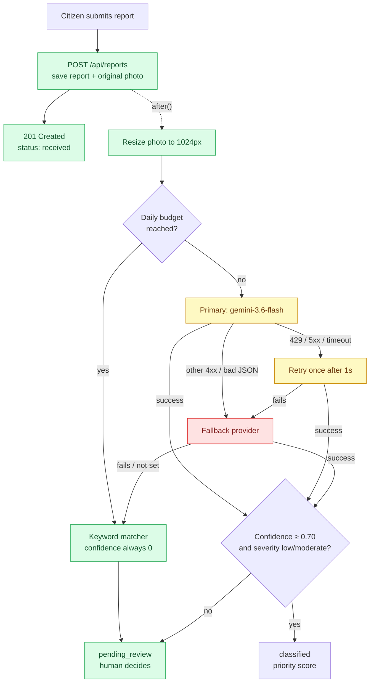
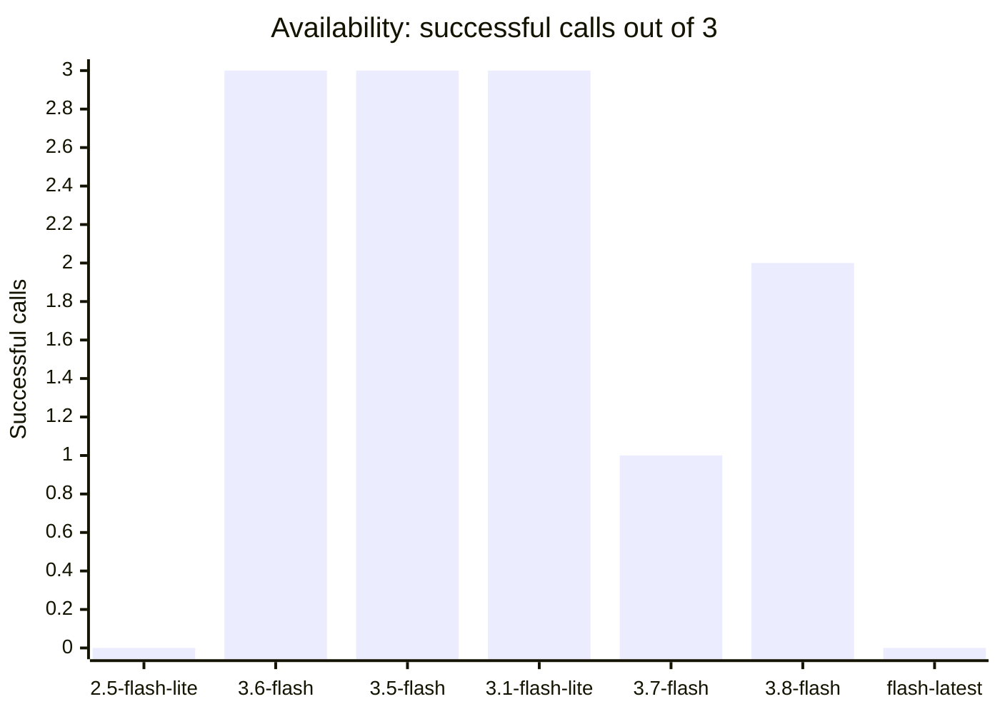
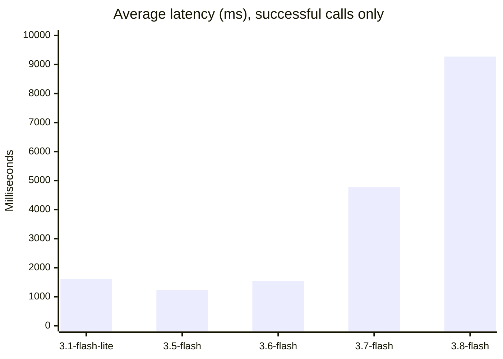
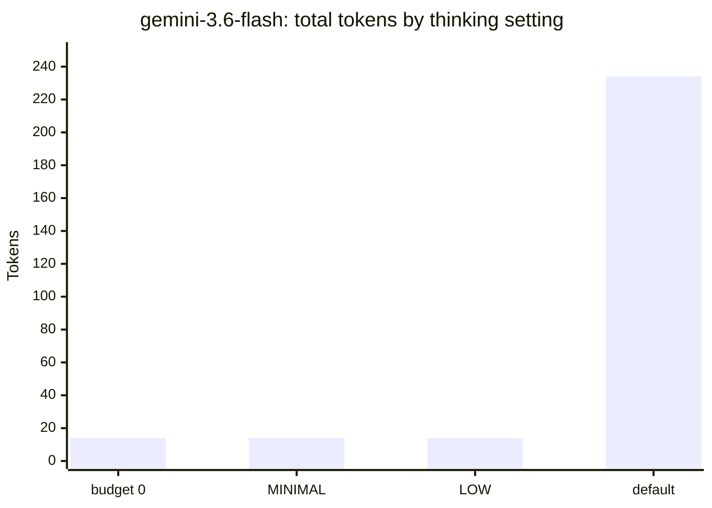
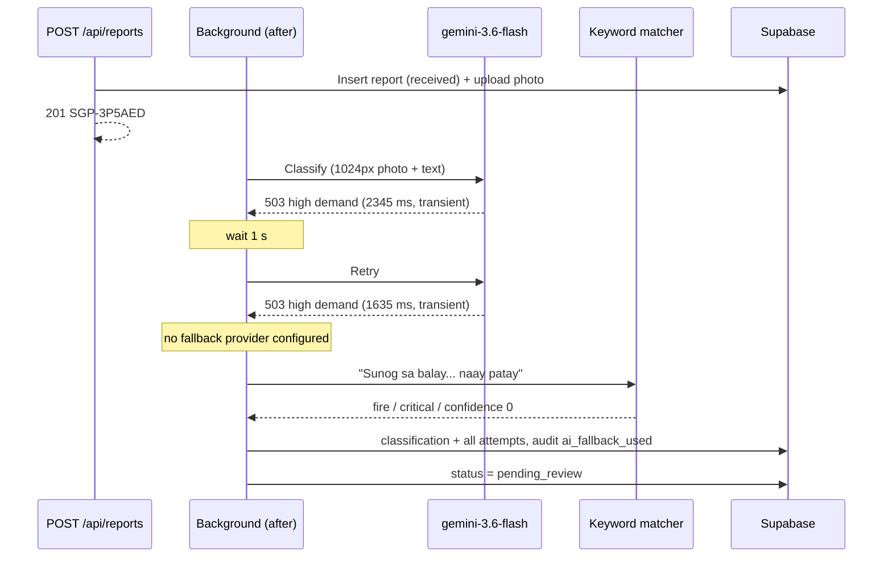
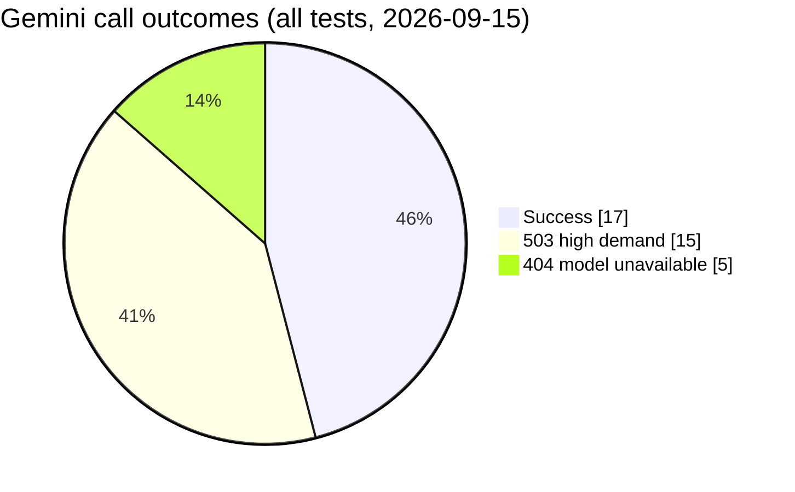
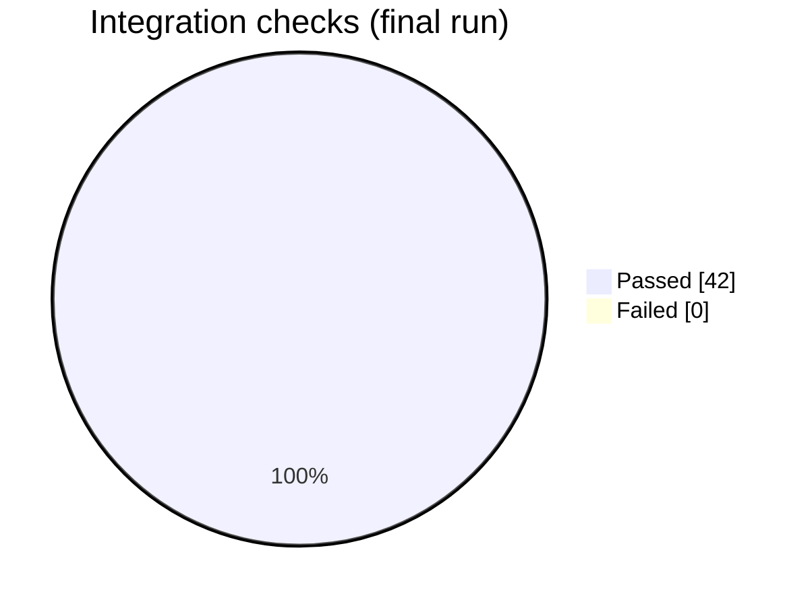
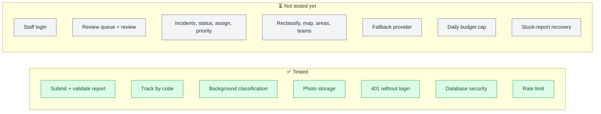

# AI Benchmarking & Testing Log

Running record of AI model checks, integration test results, and open AI issues for SAGIP-AI.
Add a new dated entry at the top for each session. Keep old entries — they show how things changed.

**Related:** formal model benchmark (accuracy on labeled photos) → [`benchmark/README.md`](../../benchmark/README.md) · plan and criteria → [DOCUMENTATION.md Appendix B](../DOCUMENTATION.md#appendix-b--ai-classification-benchmarking-plan)

---

## Quick status

| Item | Current state |
|---|---|
| Primary provider | Gemini, `gemini-3.6-flash` (`thinkingBudget: 0`) |
| Fallback provider | **Not configured** — primary failures go straight to the keyword matcher |
| Real AI classifications so far | 1 successful direct call; 0 through the app (all hit 404/503, keyword fallback used) |
| Labeled benchmark dataset | **Not started** (need 40–60 images, see `benchmark/README.md`) |
| Cost tracking for Gemini 3.6 | **Not working** — no price in `src/lib/ai/normalize.ts`, so `cost_usd` is null and the daily budget cap ignores Gemini spend |

### How a report is classified (current setup)

Red = not configured or failing in the latest test. Green = working.



---

## 2026-09-15 — First integration test against Supabase + Gemini

**Branch:** `feature/ai` · **Tester:** Claude Code session · **Environment:** local `npm run dev`, Supabase project `ttxzdvpuitzeypvmzfez`, Gemini API key (Google AI Studio)

### 1. Model availability for this API key

Direct `generateContent` calls, short text prompt, JSON output, `thinkingBudget: 0`, 3 tries each (run ~12:55 UTC).

| Model | Try 1 | Try 2 | Try 3 | Verdict |
|---|---|---|---|---|
| `gemini-2.5-flash` | 404 | 404 | — | ❌ "no longer available to new users" (was our old default; 2 calls from the first app run, not in the 3-try probe) |
| `gemini-2.5-flash-lite` | 404 | 404 | 404 | ❌ Not available |
| `gemini-3.6-flash` | ok 1738 ms | ok 1550 ms | ok 1343 ms | ✅ Now default. But see §3: 503 on 5 of 6 tries ~2 min earlier |
| `gemini-3.5-flash` | ok 1189 ms | ok 1249 ms | ok 1253 ms | ✅ Fastest and most stable in this run → **candidate fallback** |
| `gemini-3.1-flash-lite` | ok 1032 ms | ok 1754 ms | ok 2040 ms | ✅ Stable, likely cheapest → candidate fallback / benchmark |
| `gemini-3.7-flash` | ok 4776 ms | 503 | 503 | ⚠️ Unreliable |
| `gemini-3.8-flash` | ok 10291 ms | 503 | ok 8257 ms | ⚠️ Slow and unreliable |
| `gemini-flash-latest` | 503 | 503 | 503 | ❌ Unavailable during test |

Successful calls out of 3 per model:



Average latency of successful calls (lower is better):



Thinking settings on `gemini-3.6-flash` (tiny prompt):

| Config | Result | Total tokens |
|---|---|---|
| `thinkingBudget: 0` (what the code uses) | ok 1927 ms | 14 (no thinking tokens) |
| `thinkingLevel: "MINIMAL"` | ok 1598 ms | 14 |
| `thinkingLevel: "LOW"` | ok 1393 ms | 14 |
| No thinking config | ok 2405 ms | 234 (**220 thinking tokens**) |



→ `thinkingBudget: 0` still works on Gemini 3.x and avoids paying for thinking tokens.

> Availability changed within minutes (3.6-flash went from mostly 503 to 3/3 ok). Treat one run as a snapshot, not a verdict. Re-run before choosing a model.

### 2. Classifier output quality (direct call, `createGeminiClassifier`)

| Input | Tries | Result | Latency | Tokens in/out |
|---|---|---|---|---|
| Text: "Baha abot hawak sa among barangay, daghang tawo na-stranded sa atop" | 4 × 503 | ❌ No result | — | — |
| Photo (plain blue 800×600 placeholder) + "Nabangga ang motor ug jeep, nasamad ang driver" | 503, then ok | `road_accident`, `high`, confidence 0.5, hazards: injured driver, road obstruction, traffic disruption | **11,593 ms** | 1265 / 30 |

Notes:
- JSON schema output parsed and validated correctly.
- Confidence 0.5 is reasonable: the photo was a blank placeholder that didn't match the text.
- 1265 input tokens for an 800×600 image + prompt — in line with the Appendix B estimate (~1,350 at 1000×1000).
- 11.6 s latency is high; could be load-related (503s at the time). Re-measure.
- **No real incident photos tested yet.** Accuracy is unknown until the labeled dataset exists.

### 3. Fallback chain behaviour (through `POST /api/reports`)

| Run | Primary result | Retry | Fallback provider | Final step | Correct? |
|---|---|---|---|---|---|
| #1 (`gemini-2.5-flash`) | 404, `transient: false` | Skipped (correct — 404 isn't retryable) | Not configured | `keyword-fallback` | ✅ |
| #2 (`gemini-3.6-flash`) | 503, `transient: true` | 503 after ~1 s | Not configured | `keyword-fallback` | ✅ |

Run #2, photo report `SGP-3P5AED`:



All Gemini calls made during this session:



Keyword fallback output:

| Description | Type | Severity | Matched words |
|---|---|---|---|
| "Sunog sa balay sa among silingan, naay patay" | `fire` | `critical` | sunog (+ "patay" for severity) |
| "Baha abot tuhod sa dalan" | `flood` | `moderate` | baha |

Both reports → `pending_review` (confidence 0), no priority score, audit log `report_submitted → ai_fallback_used → report_classified`. Every attempt (status, message, latency, transient flag) was stored in `classifications.raw_response.attempts`.

### 4. Backend integration tests (no-login endpoints)

Final run: **42/42 checks passed** after fixes.





| Area | Checks | Result |
|---|---|---|
| Report validation (missing location, no photo/description, non-image file) | 3 | ✅ (location bug fixed, see §5) |
| Submit photo report / text report → 201 `received` + `SGP-XXXXXX` code | 2 | ✅ |
| Track by code (case-insensitive), unknown code → 404 | 2 | ✅ |
| Background classification finishes (`after()`) | 2 | ✅ ~4–11 s |
| Area linked from location, one classification row, consistent routing | 6 | ✅ |
| Original 3000×2000 photo kept in storage (AI gets 1024 px copy) | 1 | ✅ |
| 12 staff endpoints without login → 401 | 12 | ✅ |
| Login with unknown account → 401 | 1 | ✅ |
| Public key cannot read reports/classifications/audit_logs/priority_scores/incidents/profiles/teams | 7 | ✅ |
| Public key can read areas (public by design) | 1 | ✅ |
| Public key cannot run `upsert_area` / `backfill_report_areas` | 2 | ✅ after migration 0005 |
| Public key cannot insert reports or list private photos | 2 | ✅ |
| Rate limit: 6th request from one IP → 429, `Retry-After: 600` | 1 | ✅ |

**Not tested yet:** staff login and everything behind it (review queue, review, incidents, status, assign, priority override, reclassify, map, areas, teams) — needs test staff accounts. Also untested: fallback provider step, daily budget cap, stuck-report recovery.

### 5. Bugs found and fixed

| Bug | Impact | Fix | Commit |
|---|---|---|---|
| `upsert_area` / `backfill_report_areas` callable by anyone with the public key | Anyone could attempt to overwrite area data (RLS blocked the writes, but functions shouldn't be exposed) | Migration `0005_lock_admin_functions.sql` revokes `PUBLIC` execute | `fix(db): revoke public execute on admin-only functions` |
| Missing `lat`/`lng` accepted as 0,0 (`Number(null) === 0`) | Reports saved in the ocean off Africa; wrong area/score | Require non-empty values before parsing | `fix(backend): reject reports without a location` |
| Default model `gemini-2.5-flash` returns 404 for new API keys | Every report fell back to keywords | Default → `gemini-3.6-flash` | `fix(ai): default to gemini-3.6-flash` |
| Gemini thinking tokens not counted in output tokens | Cost under-reported if thinking is ever enabled | Add `thoughtsTokenCount` to output tokens | same commit |

### 6. Open issues / decisions for the team

1. **Configure a fallback provider.** Suggested: `AI_FALLBACK_PROVIDER=gemini`, `AI_FALLBACK_MODEL=gemini-3.5-flash`, same key in `AI_FALLBACK_API_KEY`. Cheap insurance against 503 spikes. A different vendor (Claude) is stronger insurance against a whole-provider outage.
2. **Add Gemini 3.x prices** to `PRICES` in `src/lib/ai/normalize.ts` from the official pricing page. Until then `cost_usd` is null and `AI_DAILY_BUDGET_USD` won't count Gemini calls.
3. **Latency** — 11.6 s with an image during a 503 spike; `AI_TIMEOUT_MS` is 20 s. Re-measure when load is normal.
4. **Build the labeled dataset** and run `npm run benchmark` for `gemini-3.6-flash`, `gemini-3.5-flash`, `gemini-3.1-flash-lite` (and Claude if you have a key). Only then pick the default model and confidence threshold.
5. **Test data in Supabase** from this session (safe to delete from the Table Editor; deleting a report cascades to its classifications and audit logs; photos stay in the `report-photos` bucket under their tracking code):

   | Report id | Code | Note |
   |---|---|---|
   | `38bfd24a-b49c-4bea-bade-7786e081a36b` | `SGP-4SBETJ` | Junk report at 0,0 from the location bug |
   | `ba6f8366-1046-4ee1-bf83-221489206a54` | `SGP-EUUG9Y` | Test fire report (with photo) |
   | `f923612d-7b7e-44d0-8dd3-d76c09e2dd5f` | `SGP-FZJ2KL` | Test flood report (text only) |
   | `f1a88119-54c6-4e2d-9ddd-f1cd9e2a66c8` | `SGP-3P5AED` | Test fire report (with photo) |
   | `ccaa17ba-a320-40e3-9a2a-17f03984b0ee` | `SGP-5YJ62S` | Test flood report (text only) |

---

## Entry template

```markdown
## YYYY-MM-DD — <what was tested>

**Branch:** · **Tester:** · **Environment:**

### Model availability
| Model | Try 1 | Try 2 | Try 3 | Verdict |

### Classifier results
| Input | Result | Latency | Tokens | Cost |

### Integration tests
| Area | Checks | Result |

### Bugs found / fixed
| Bug | Impact | Fix | Commit |

### Open issues
```
