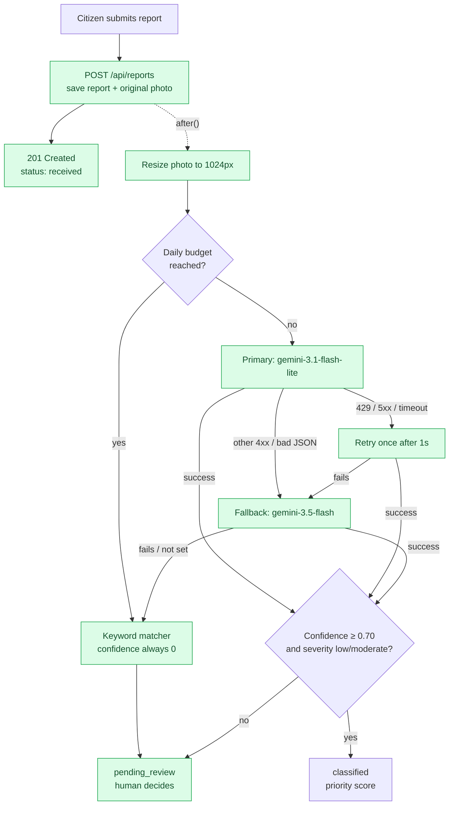
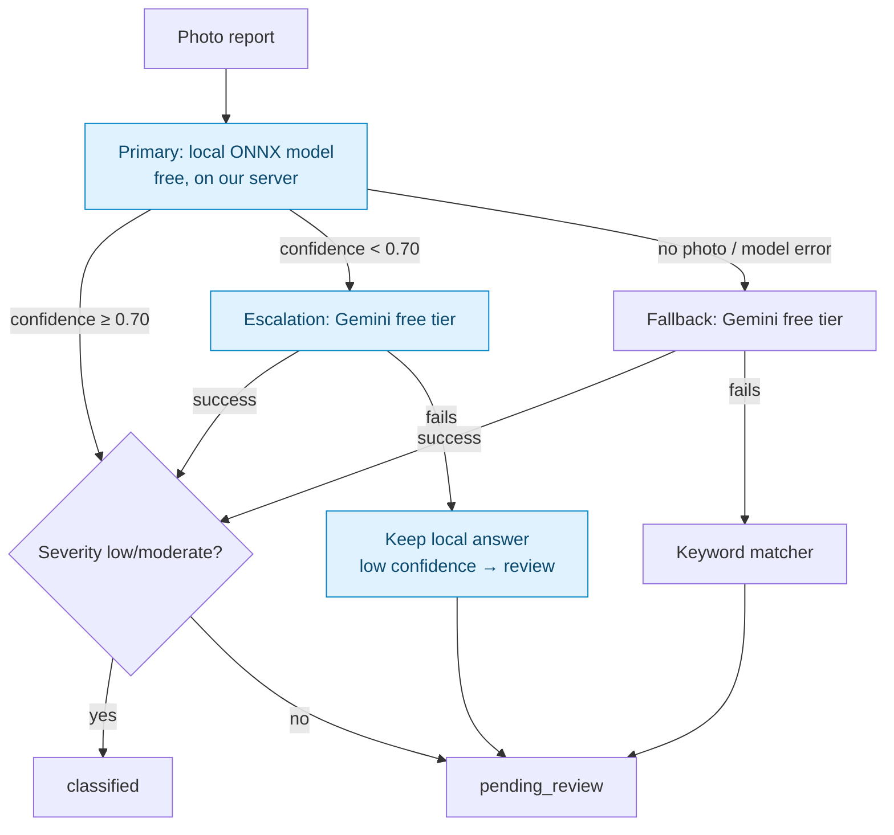
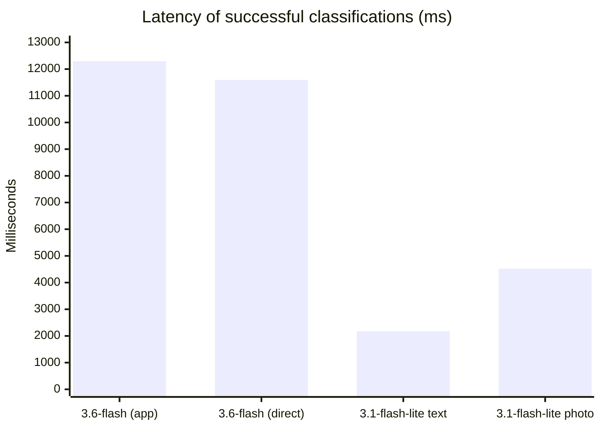
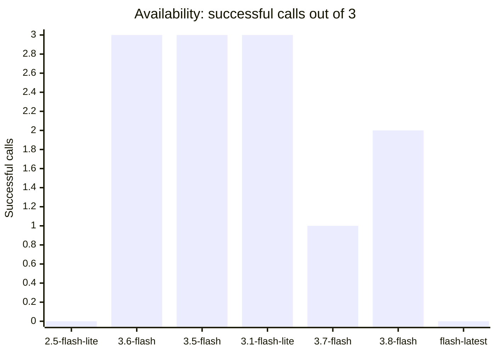
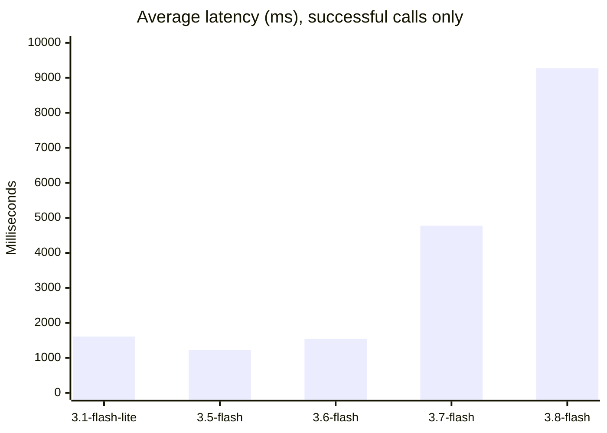
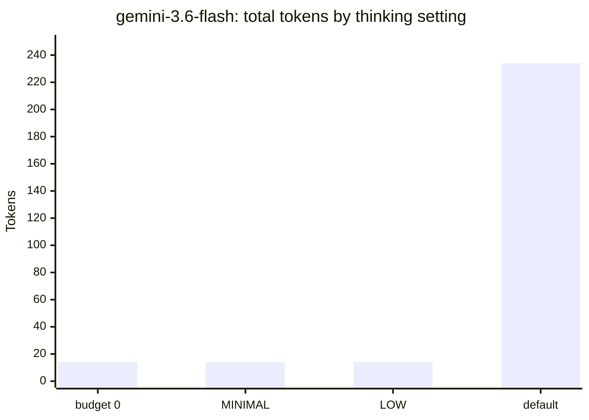
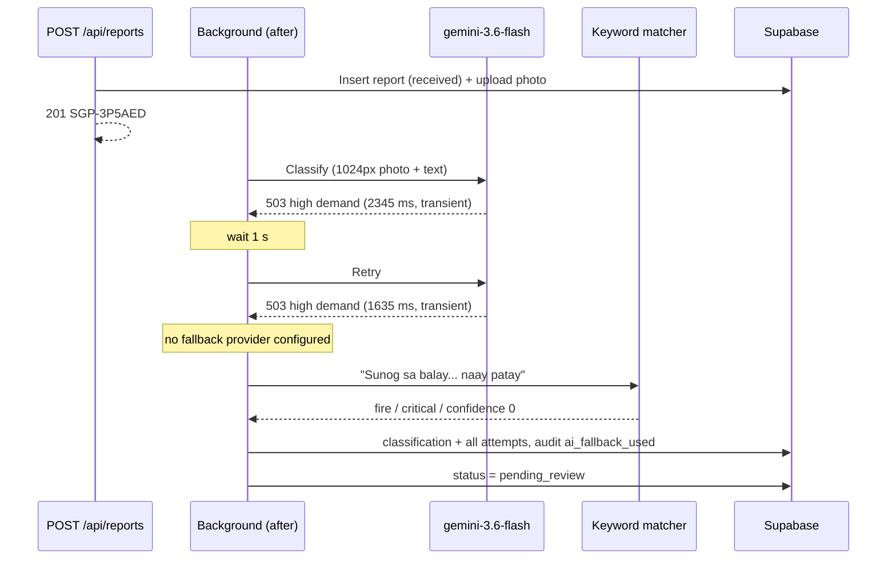
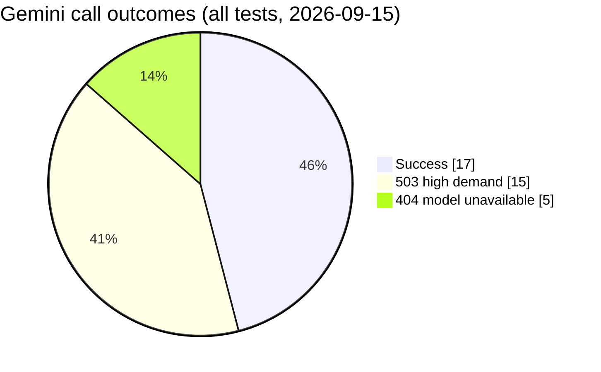
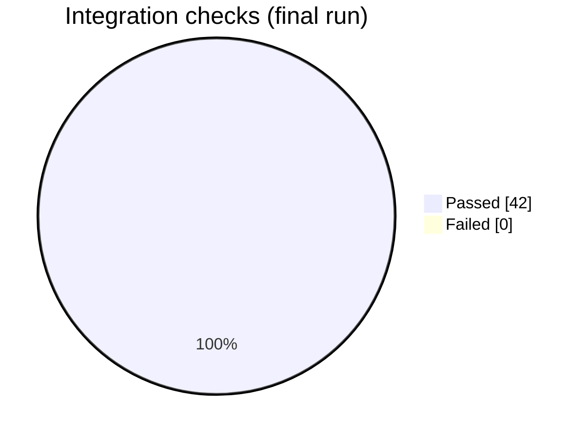

# AI Benchmarking & Testing Log

Running record of AI model checks, integration test results, and open AI issues for SAGIP-AI.
Add a new dated entry at the top for each session. Keep old entries — they show how things changed.

**Related:** formal model benchmark (accuracy on labeled photos) → [`benchmark/README.md`](../../benchmark/README.md) · plan and criteria → [DOCUMENTATION.md Appendix B](../DOCUMENTATION.md#appendix-b--ai-classification-benchmarking-plan)

---

## Quick status

| Item | Current state |
|---|---|
| Primary provider | Gemini, `gemini-3.1-flash-lite` (`thinkingBudget: 0`, 15 RPM free tier) |
| Fallback provider | Gemini, `gemini-3.5-flash` (same key, separate 5 RPM quota) |
| Real AI classifications so far | 1 through the app (`SGP-KBL2UX`), 3 direct Gemini calls. Our own model has additionally been run on 36 held-out photos at no cost |
| Labeled benchmark dataset | 36 held-out photos in `benchmark/dataset/`. **Severity column still blank**, so the Gemini comparison cannot run yet |
| Cost tracking for Gemini 3.x | **Not working** — no price in `src/lib/ai/normalize.ts`, so `cost_usd` is null and the daily budget cap ignores Gemini spend. Matters less while on the free tier with no billing linked |
| Team constraint | **Free only.** No paid APIs, no billing accounts. Free tiers that reset daily, for development and the final demo (Nov 2026) |
| Llama provider | In the code (`llama.ts`), **not usable for free**: Groq dropped Llama vision models, other hosts need credits. Not planned |
| Own model (`local` provider) | **Trained and installed** (2026-09-23): 79.8% test accuracy over 6 types, 41 ms per photo, free. Not yet the primary provider |

### How a report is classified (current setup)

Green = configured and working in the latest test.



### Planned setup once our own model is trained

Set `AI_PROVIDER=local`. Our model answers first for free. Only unsure answers use the Gemini free-tier quota.



---

## 2026-09-26 — Hoax-suspected flag added and tested against Gemini

**Branch:** `feat/ai` (squashed into `development`) · **Environment:** local, live Gemini calls: 2

### What it does
The classifier now returns `hoaxSuspected`. It is set only when there is a clear sign the report is not genuine: an unrelated meme, screenshot or stock photo, a joking or nonsensical description, or a photo and description describing unrelated things. When in doubt the prompt says return false.

A flagged report is **never rejected automatically**. `needsReview()` simply treats the flag as a third reason to send it to a human, alongside low confidence and high or critical severity. Reviewers see a "Possible hoax" tag in the review queue and on the incident page.

The keyword matcher and our own image model always return false: neither can judge intent, and keyword results already go to review.

Stored in `classifications.hoax_suspected` (migration `0006_hoax_flag.sql`, applied 2026-09-26).

### Live test (`gemini-3.1-flash-lite`)
| Input | Result | hoaxSuspected |
|---|---|---|
| Plain yellow graphic + "PRANK!! ... wala man dire sunog joke lang guys" | `other` / `low`, confidence 1.00 | **true** |
| Real flood photo + "Baha sa amoa, abot hawak na ang tubig, naay mga tawo sa atop" | `flood` / `critical`, confidence 0.95, hazards: rising water, severe weather conditions | **false** |

The fake case is the one that matters: the model was fully confident and rated it low severity, so neither the confidence rule nor the severity rule would have caught it. Without this flag the report would have been classified automatically with no human ever seeing it.

### Notes
- Token cost is unchanged in practice: 1,374 in / 44 out for the hoax case, in line with earlier photo reports.
- The flag is advisory. A genuine report wrongly flagged only costs a reviewer a few seconds, which is the right trade for a system where a missed real emergency is far worse.

---

## 2026-09-23 — First training run of our own model, installed and tested

**Branch:** `feat/ai` · **Tester:** Claude Code session · **Environment:** Colab T4 GPU (training), local CPU (inference). No paid APIs, no Gemini quota used.

### Dataset
Built from three free Kaggle downloads with `npm run dataset:prepare`: the Comprehensive Disaster Dataset (CDD), a cyclone/wildfire/flood/earthquake set, a forest-fire set, and two general disaster sets.

| Type | Training photos | Sources |
|---|---|---|
| flood | 1,666 | 5 |
| fire | 1,498 | 5 |
| structural_damage | 1,472 | 4 (earthquake damage) |
| other (normal scenes) | 1,139 | 4 |
| landslide | 691 | 2 |
| medical_emergency | 229 | 1 |
| road_accident | 0 | none found in free datasets |
| fallen_debris | 0 | none found in free datasets |

Total 6,695 training photos, plus 36 held out for the benchmark and never trained on.
The script removed 239 duplicates (including a second copy of CDD inside another download), 18 photos filed under two types, 2 too small and 1 unreadable.

Data problems found and worth citing in the thesis:
- CDD repeats the same photos in `Damaged_Infrastructure/Earthquake` and `Land_Disaster/Land_Slide`. All 36 Earthquake photos had a twin in the landslide folder. The landslide copies were removed as mislabeled.
- CDD `Human_Damage` is graphic conflict imagery, not Philippine medical emergencies.
- Many flood photos are aerial, while citizens submit ground-level phone photos.

### Training (`training/sagip_classifier_colab.ipynb`)
EfficientNet-B0, transfer learning: 5 epochs on the new head, then 10 fine-tuning the whole model. Class weights compensate for the rare types.

| Metric | Result |
|---|---|
| Test accuracy (1,005 unseen photos) | **79.8%** |
| Best validation accuracy | 79.7% |
| Brier score (confidence reliability, lower is better) | 0.124 |
| Exported model size | 16.5 MB (ONNX, weights in a separate `.onnx.data` file) |

Per type (recall): fire 193/225 (86%), landslide 82/104 (79%), other 135/171 (79%), flood 193/250 (77%), structural_damage 166/221 (75%), medical_emergency 33/34 (97%).

**Known weakness: `medical_emergency` is over-predicted.** It catches almost every true case, but 96 photos were predicted as medical when only 33 were, so its precision is about 34 percent. Cause: far fewer training photos (229 against roughly 1,500), so the class weighting overshot. Other confusions match the data problems above: structural_damage against landslide (17) and flood (6).

Artifacts: `docs/training-runs/2026-09-23/` (metrics.json, confusion_matrix.png, labels.json).

### Installed and tested locally (`local` provider)
Model copied to `models/`, then run against the 36 held-out benchmark photos through `src/lib/ai/local.ts`.

| Check | Result |
|---|---|
| Accuracy on held-out photos | 26/36 (72.2%) |
| Mean latency | 41 ms per photo (CPU, no API call) |
| Cost | Zero |
| Wrong answers with confidence at or above 0.70 | **0** |

At the current `CONFIDENCE_THRESHOLD` of 0.7, 21 of 36 photos would be classified automatically and **all 21 were correct**; the other 15 fall below the threshold and go to human review. This is the behaviour the design intends: the model is useful on clear photos and defers when unsure.

### Notes
- The ONNX export produces two files. `sagip-classifier.onnx` and `sagip-classifier.onnx.data` must stay together in `models/`, or the model will not load.
- `labels.json` lists only the 6 trained types. The provider rejects any class the app does not know, so this is checked at load time.
- Both files are git-ignored because of their size; share them through Drive.

### Open issues
1. No `road_accident` or `fallen_debris` photos. The model cannot predict them, so those reports fall to the other types or to human review.
2. Fix the `medical_emergency` over-prediction: more photos for that type, or less aggressive class weighting.
3. Fill in the severity column in `benchmark/dataset/labels.csv`, then run the benchmark to compare this model against Gemini on identical photos.
4. Severity is still taken from description keywords; the model only predicts the incident type.

---

## 2026-09-21 — Llama checked and dropped; own-model path added

**Branch:** `feat/ai` · **Tester:** Claude Code session · **Environment:** local, no app server

### Decision: free AI only
The team has no budget. Rule from now on: only free tiers that reset daily and **cannot charge** (no billing account linked). Paid providers stay in the code but are not configured.

### Llama (Meta) — added, tested, not usable for free
| Check | Result |
|---|---|
| `llama` provider added (`src/lib/ai/llama.ts`), OpenAI-compatible, any host via `AI_BASE_URL` | Passed. Stub-server test: request format, image upload, JSON parsing, cost, 429 → retry all correct |
| Groq (free, daily reset) — 1 real call | Failed. 404 `model_not_found`. Groq's model list has **no Llama chat/vision models** left, only `llama-prompt-guard-2` (prompt-injection filters) |
| OpenRouter (`meta-llama/llama-4-scout`, $0.10 / $0.30 per 1M) | Works on paper, but needs credits. **Rejected** by the team (cost risk) |

API usage this session: 1 failed Groq call (no generation), 1 free model-list call. No Gemini quota used.

### Own model — `local` provider (commit `c955909`)
Instead of an API, train a small image classifier (EfficientNet-B0 / MobileNetV3, transfer learning) on free Colab and run it on our server with ONNX Runtime. No quota, no cost, works offline.

| Piece | File | Status |
|---|---|---|
| Training notebook (split, augment, train, test-set metrics, ONNX export + check) | `training/sagip_classifier_colab.ipynb` | Passed. Code cells syntax-checked. Not run yet (needs photos + GPU) |
| Provider | `src/lib/ai/local.ts` | Passed. Tested with a fake ONNX model |
| Chain: escalate unsure local answers to the fallback | `src/lib/ai/chain.ts` (new step `escalation`) | Passed. Tested, see below |
| Benchmark support | `npm run benchmark -- --models local,gemini:gemini-3.1-flash-lite` | Done |

How the local provider works:
- The model sees **only the photo** and predicts the incident type. Confidence = its top softmax probability.
- **Severity and hazards come from the description keywords** (same English/Filipino/Cebuano lists as the keyword matcher), else a default per type. Severity is not trained yet.
- Needs a photo. Text-only reports skip to the fallback.
- Still runs when the daily budget is reached, since it's free.

Chain test (fake model: red → fire, blue → flood; fake fallback server, no real API):

| Case | Final step | Result | Fallback calls |
|---|---|---|---|
| Confident local answer (red photo) | `primary` | fire, used as-is | 0 |
| Unsure local answer (grey photo) | `escalation` | fallback's answer | 1 |
| Unsure, fallback returns 500 | `primary` | local answer kept → review (low confidence) | 1 (failed) |
| No photo | `fallback` | fallback's answer | 1 |

### Dataset preparation (added later the same day)
- `training/README.md`: free public datasets (Kaggle, CrisisMMD, MEDIC and others), their licenses, and how their classes map to ours. Gaps: `medical_emergency`, `fallen_debris` and street-level `road_accident` need our own photos.
- `npm run dataset:prepare`: removes broken, tiny and duplicate photos (perceptual hash, keeps the largest copy), flags photos filed under two types, shrinks to 1024 px, and holds out 6 per type for `benchmark/dataset/` with a `labels.csv` whose severity column is left blank for a person to fill in.
- Tested with generated photos: duplicates, a resized copy, a tiny and a corrupt file, a cross-type conflict and a bad folder name were all handled. Rebuilding with `--holdout 0` kept all 4 benchmark photos out of training. An existing `labels.csv` is never overwritten without `--force`.

### Open issues
1. **Collect training photos:** 100–300 per incident type, messy real-world ones included. Nothing else on this path can start without them. See `training/README.md`.
2. Fill in severity in `benchmark/dataset/labels.csv` after running `npm run dataset:prepare`.
3. Model file `models/sagip-classifier.onnx` + `labels.json` must be deployed with the app (~20 MB).
4. Gemini 3.x prices still missing (see Quick status). Low priority while on the free tier.

---

## 2026-09-15 (later) — Switched primary to `gemini-3.1-flash-lite`

**Why:** Free tier hit the **requests-per-minute** limit (5 RPM) on `gemini-3.6-flash` and `gemini-3.8-flash`. Token usage was under 1% (2.22K / 250K TPM). `gemini-3.1-flash-lite` allows **15 RPM**. Limits are per model, so the `gemini-3.5-flash` fallback has its own quota.

**Config (`.env.local`):** `AI_MODEL=gemini-3.1-flash-lite`, `AI_FALLBACK_MODEL=gemini-3.5-flash`

| Input | Result | Confidence | Latency | Tokens in/out |
|---|---|---|---|---|
| "Sunog sa balay sa among silingan, daghang aso, naay tawo sulod" | `fire` / `critical`, hazards: heavy smoke, people trapped inside | 0.95 | 2179 ms | 211 / 54 |
| Grey placeholder photo + "Natumba ang kahoy sa dalan, nababagan ang karsada" | `fallen_debris` / `moderate`, hazards: blocked road, fallen tree | 0.95 | 4522 ms | 1270 / 36 |

Also: first successful classification through the app, via the test UI (`SGP-KBL2UX`, still on `gemini-3.6-flash`): `fallen_debris` / `moderate`, confidence 0.85, 12.3 s, first try → `classified`, priority **P2 (64)**.



**Caution:** confidence 0.95 on a blank grey photo means the model trusted the text entirely. Accuracy on real photos is still unmeasured — run the benchmark before relying on it.

---

## 2026-09-15 — First integration test against Supabase + Gemini

**Branch:** `feature/ai` · **Tester:** Claude Code session · **Environment:** local `npm run dev`, Supabase project `ttxzdvpuitzeypvmzfez`, Gemini API key (Google AI Studio)

### 1. Model availability for this API key

Direct `generateContent` calls, short text prompt, JSON output, `thinkingBudget: 0`, 3 tries each (run ~12:55 UTC).

| Model | Try 1 | Try 2 | Try 3 | Verdict |
|---|---|---|---|---|
| `gemini-2.5-flash` | 404 | 404 | — | Unavailable. "no longer available to new users" (was our old default; 2 calls from the first app run, not in the 3-try probe) |
| `gemini-2.5-flash-lite` | 404 | 404 | 404 | Unavailable |
| `gemini-3.6-flash` | ok 1738 ms | ok 1550 ms | ok 1343 ms | Available. Now default. But see §3: 503 on 5 of 6 tries ~2 min earlier |
| `gemini-3.5-flash` | ok 1189 ms | ok 1249 ms | ok 1253 ms | Available. Fastest and most stable in this run → **candidate fallback** |
| `gemini-3.1-flash-lite` | ok 1032 ms | ok 1754 ms | ok 2040 ms | Available. Stable, likely cheapest → candidate fallback / benchmark |
| `gemini-3.7-flash` | ok 4776 ms | 503 | 503 | Unreliable |
| `gemini-3.8-flash` | ok 10291 ms | 503 | ok 8257 ms | Slow and unreliable |
| `gemini-flash-latest` | 503 | 503 | 503 | Unavailable during test |

Successful calls out of 3 per model:



Average latency of successful calls (lower is better):



Thinking settings on `gemini-3.6-flash` (tiny prompt):

| Config | Result | Total tokens |
|---|---|---|
| `thinkingBudget: 0` (what the code uses) | ok 1927 ms | 14 (no thinking tokens) |
| `thinkingLevel: "MINIMAL"` | ok 1598 ms | 14 |
| `thinkingLevel: "LOW"` | ok 1393 ms | 14 |
| No thinking config | ok 2405 ms | 234 (**220 thinking tokens**) |



→ `thinkingBudget: 0` still works on Gemini 3.x and avoids paying for thinking tokens.

> Availability changed within minutes (3.6-flash went from mostly 503 to 3/3 ok). Treat one run as a snapshot, not a verdict. Re-run before choosing a model.

### 2. Classifier output quality (direct call, `createGeminiClassifier`)

| Input | Tries | Result | Latency | Tokens in/out |
|---|---|---|---|---|
| Text: "Baha abot hawak sa among barangay, daghang tawo na-stranded sa atop" | 4 × 503 | Failed, no result | — | — |
| Photo (plain blue 800×600 placeholder) + "Nabangga ang motor ug jeep, nasamad ang driver" | 503, then ok | `road_accident`, `high`, confidence 0.5, hazards: injured driver, road obstruction, traffic disruption | **11,593 ms** | 1265 / 30 |

Notes:
- JSON schema output parsed and validated correctly.
- Confidence 0.5 is reasonable: the photo was a blank placeholder that didn't match the text.
- 1265 input tokens for an 800×600 image + prompt — in line with the Appendix B estimate (~1,350 at 1000×1000).
- 11.6 s latency is high; could be load-related (503s at the time). Re-measure.
- **No real incident photos tested yet.** Accuracy is unknown until the labeled dataset exists.

### 3. Fallback chain behaviour (through `POST /api/reports`)

| Run | Primary result | Retry | Fallback provider | Final step | Correct? |
|---|---|---|---|---|---|
| #1 (`gemini-2.5-flash`) | 404, `transient: false` | Skipped (correct — 404 isn't retryable) | Not configured | `keyword-fallback` | Yes |
| #2 (`gemini-3.6-flash`) | 503, `transient: true` | 503 after ~1 s | Not configured | `keyword-fallback` | Yes |

Run #2, photo report `SGP-3P5AED`:



All Gemini calls made during this session:



Keyword fallback output:

| Description | Type | Severity | Matched words |
|---|---|---|---|
| "Sunog sa balay sa among silingan, naay patay" | `fire` | `critical` | sunog (+ "patay" for severity) |
| "Baha abot tuhod sa dalan" | `flood` | `moderate` | baha |

Both reports → `pending_review` (confidence 0), no priority score, audit log `report_submitted → ai_fallback_used → report_classified`. Every attempt (status, message, latency, transient flag) was stored in `classifications.raw_response.attempts`.

### 4. Backend integration tests (no-login endpoints)

Final run: **42/42 checks passed** after fixes.




| Area | Checks | Result |
|---|---|---|
| Report validation (missing location, no photo/description, non-image file) | 3 | Pass (location bug fixed, see §5) |
| Submit photo report / text report → 201 `received` + `SGP-XXXXXX` code | 2 | Pass |
| Track by code (case-insensitive), unknown code → 404 | 2 | Pass |
| Background classification finishes (`after()`) | 2 | Pass ~4–11 s |
| Area linked from location, one classification row, consistent routing | 6 | Pass |
| Original 3000×2000 photo kept in storage (AI gets 1024 px copy) | 1 | Pass |
| 12 staff endpoints without login → 401 | 12 | Pass |
| Login with unknown account → 401 | 1 | Pass |
| Public key cannot read reports/classifications/audit_logs/priority_scores/incidents/profiles/teams | 7 | Pass |
| Public key can read areas (public by design) | 1 | Pass |
| Public key cannot run `upsert_area` / `backfill_report_areas` | 2 | Pass after migration 0005 |
| Public key cannot insert reports or list private photos | 2 | Pass |
| Rate limit: 6th request from one IP → 429, `Retry-After: 600` | 1 | Pass |

**Not tested yet:** staff login and everything behind it (review queue, review, incidents, status, assign, priority override, reclassify, map, areas, teams) — needs test staff accounts. Also untested: fallback provider step, daily budget cap, stuck-report recovery.

### 5. Bugs found and fixed

| Bug | Impact | Fix | Commit |
|---|---|---|---|
| `upsert_area` / `backfill_report_areas` callable by anyone with the public key | Anyone could attempt to overwrite area data (RLS blocked the writes, but functions shouldn't be exposed) | Migration `0005_lock_admin_functions.sql` revokes `PUBLIC` execute | `fix(db): revoke public execute on admin-only functions` |
| Missing `lat`/`lng` accepted as 0,0 (`Number(null) === 0`) | Reports saved in the ocean off Africa; wrong area/score | Require non-empty values before parsing | `fix(backend): reject reports without a location` |
| Default model `gemini-2.5-flash` returns 404 for new API keys | Every report fell back to keywords | Default → `gemini-3.6-flash` | `fix(ai): default to gemini-3.6-flash` |
| Gemini thinking tokens not counted in output tokens | Cost under-reported if thinking is ever enabled | Add `thoughtsTokenCount` to output tokens | same commit |

### 6. Open issues / decisions for the team

1. **Configure a fallback provider.** Suggested: `AI_FALLBACK_PROVIDER=gemini`, `AI_FALLBACK_MODEL=gemini-3.5-flash`, same key in `AI_FALLBACK_API_KEY`. Cheap insurance against 503 spikes. A different vendor (Claude) is stronger insurance against a whole-provider outage.
2. **Add Gemini 3.x prices** to `PRICES` in `src/lib/ai/normalize.ts` from the official pricing page. Until then `cost_usd` is null and `AI_DAILY_BUDGET_USD` won't count Gemini calls.
3. **Latency** — 11.6 s with an image during a 503 spike; `AI_TIMEOUT_MS` is 20 s. Re-measure when load is normal.
4. **Build the labeled dataset** and run `npm run benchmark` for `gemini-3.6-flash`, `gemini-3.5-flash`, `gemini-3.1-flash-lite` (and Claude if you have a key). Only then pick the default model and confidence threshold.
5. **Test data in Supabase** from this session (safe to delete from the Table Editor; deleting a report cascades to its classifications and audit logs; photos stay in the `report-photos` bucket under their tracking code):

   | Report id | Code | Note |
   |---|---|---|
   | `38bfd24a-b49c-4bea-bade-7786e081a36b` | `SGP-4SBETJ` | Junk report at 0,0 from the location bug |
   | `ba6f8366-1046-4ee1-bf83-221489206a54` | `SGP-EUUG9Y` | Test fire report (with photo) |
   | `f923612d-7b7e-44d0-8dd3-d76c09e2dd5f` | `SGP-FZJ2KL` | Test flood report (text only) |
   | `f1a88119-54c6-4e2d-9ddd-f1cd9e2a66c8` | `SGP-3P5AED` | Test fire report (with photo) |
   | `ccaa17ba-a320-40e3-9a2a-17f03984b0ee` | `SGP-5YJ62S` | Test flood report (text only) |

---

## Entry template

```markdown
## YYYY-MM-DD — <what was tested>

**Branch:** · **Tester:** · **Environment:**

### Model availability
| Model | Try 1 | Try 2 | Try 3 | Verdict |

### Classifier results
| Input | Result | Latency | Tokens | Cost |

### Integration tests
| Area | Checks | Result |

### Bugs found / fixed
| Bug | Impact | Fix | Commit |

### Open issues
```
